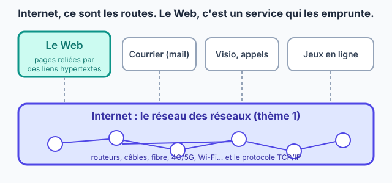
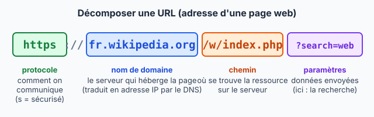

::: prof
**Mise en œuvre (vendredi 9 octobre, classe entière, distanciel)** : déposer ce PDF élève dans un devoir ENT « Le Web — découverte », avec une date limite le soir même ou le lendemain. Rester connecté à la messagerie pendant l'heure.

**Suivi** : ce travail n'est pas noté. On regarde seulement s'il a été rendu et s'il est sérieux, ce qui peut alimenter une note de travail personnel. La question 5 (jeu de Wikipédia) est **propre à chaque élève**, puisque chacun part de sa propre page : une copie entre élèves s'y repère tout de suite.

**Au retour en classe** : 5 minutes de correction collective sur la frise (Q3) et sur les URL (Q6), puis l'interrogation Internet (sujets A/B) déjà prête.
:::

## Étape 1 — Défi de départ (5 min)

Réponds **sans chercher sur Internet** : c'est pour voir ce que tu sais déjà. Le corrigé est à la fin de la fiche, ne le regarde qu'après avoir répondu.

::: question 1
Quand tu regardes une vidéo sur le site YouTube dans ton navigateur, tu utilises…

- [ ] Internet, mais pas le Web
- [ ] le Web, mais pas Internet
- [x] le Web, qui fonctionne grâce à Internet
:::

::: reponse 0
Le Web, qui fonctionne grâce à Internet : la page YouTube est une page web, transportée par Internet.
:::

::: question 2
Quand tu joues en ligne sur une console, tu utilises…

- [x] Internet, mais pas forcément le Web
- [ ] le Web, mais pas Internet
- [ ] ni l'un ni l'autre
:::

::: reponse 0
Internet, mais pas forcément le Web : le jeu échange des données par Internet, sans passer par des pages web.
:::

## Étape 2 — Lire la fiche : Internet, le Web et leur histoire (15 min)

::: contexte Le Web, un service d'Internet
Au thème 1, tu as vu qu'**Internet** est un **réseau de réseaux** : des routeurs, des câbles, de la fibre, des antennes, qui transportent des paquets grâce au protocole **TCP/IP**.

Le **Web** (*World Wide Web*, la « toile d'araignée mondiale ») est **un service parmi d'autres** qui utilise Internet, comme le courrier électronique, la visio ou les jeux en ligne. Le Web, ce sont des **pages** reliées entre elles par des **liens hypertextes**.

Il repose sur trois inventions :

- le langage **HTML**, pour écrire les pages ;
- l'**URL**, pour donner une adresse unique à chaque page ;
- le protocole **HTTP**, pour demander une page à un serveur et la recevoir.
:::

::: figure Internet transporte, le Web est un des services transportés
{width=88%}
:::

::: doc DR1 | Repères historiques du Web
| Année | Événement |
| :---: | :--- |
| 1965 | Ted Nelson invente le mot **hypertexte** : un texte qui contient des liens vers d'autres textes. |
| 1969 | Naissance d'**ARPANET**, l'ancêtre d'Internet (thème 1). |
| 1989 | Au **CERN**, le laboratoire européen de physique près de Genève, **Tim Berners-Lee** propose un système de documents reliés par des liens pour partager les résultats entre chercheurs. |
| 1990 | Premier serveur web et premier navigateur, écrits par Tim Berners-Lee. |
| 1991 | Le premier site web est accessible au public. |
| 1993 | Le CERN place le Web dans le **domaine public** : tout le monde peut l'utiliser librement, sans payer. La même année, le navigateur **Mosaic** affiche texte et images sur la même page. |
| 1994 | Création du **W3C**, l'organisme qui fixe les règles du Web (HTML, CSS…). |
| 1998 | Création du moteur de recherche Google. |
| 2001 | Lancement de Wikipédia, encyclopédie écrite par ses lecteurs. |
| 2004 | Lancement de Facebook ; on parle de **Web 2.0** : les internautes publient eux-mêmes du contenu. |
| 2007 | Le premier iPhone popularise le Web sur téléphone. |
:::

::: question 3
Sans regarder le DR1, range ces événements dans l'ordre chronologique (écris seulement les lettres) :

**A.** le Web devient libre d'utilisation · **B.** invention du mot « hypertexte » · **C.** naissance de Wikipédia · **D.** Tim Berners-Lee propose le Web au CERN · **E.** naissance d'ARPANET · **F.** le Web arrive sur les smartphones

Vérifie ensuite avec le DR1 et corrige, au stylo d'une autre couleur.
:::

::: reponse 0
B (1965) → E (1969) → D (1989) → A (1993) → C (2001) → F (2007).
:::

::: question 4
En 1993, le CERN aurait pu faire payer chaque utilisation du Web. Il a choisi de le placer dans le domaine public. Explique en deux phrases pourquoi ce choix a permis au Web de se répandre dans le monde entier.
:::

::: reponse 0
Comme personne n'avait à payer ni à demander d'autorisation, n'importe qui pouvait créer un site ou un navigateur. Le nombre de sites et d'utilisateurs a donc explosé, et le Web est devenu une norme commune à tous. Accepter toute réponse qui relie gratuité et libre utilisation à la diffusion.
:::

## Étape 3 — Les liens hypertextes : le jeu de Wikipédia (15 min)

::: info Règle du jeu
Un **lien hypertexte** est un mot ou une image sur lequel on clique pour aller vers un autre contenu : une autre page, un autre site, une image, une vidéo. C'est l'idée de Ted Nelson, réalisée par Tim Berners-Lee.

1. Ouvre la page Wikipédia d'un sujet **que tu choisis** : ton sport, ta ville, ton jeu vidéo, ton artiste préféré…
2. En cliquant **uniquement sur des liens à l'intérieur des articles** (pas de barre de recherche, pas de retour en arrière), essaie d'arriver à la page **« World Wide Web »**.
3. Note chaque page traversée et compte tes clics. Moins de clics, c'est mieux !
:::

::: question 5
Recopie ton parcours : le **titre de chaque page** et, pour la première et la dernière, l'**URL complète** (copiée depuis la barre d'adresse). Combien de clics as-tu faits ?
:::

::: reponse 0
Réponse propre à chaque élève. Vérifier que le parcours est cohérent : chaque page doit contenir un lien vers la suivante. Exemple : Judo → Japon → Internet → World Wide Web (3 clics). Dernière URL attendue : `https://fr.wikipedia.org/wiki/World_Wide_Web`.
:::

## Étape 4 — Lire une URL (15 min)

::: figure Les parties d'une URL
{width=95%}
:::

::: retenir
Une **URL** est l'adresse unique d'une ressource sur le Web. Elle contient :

- le **protocole** (`http` ou `https`) : `https` signifie que les échanges sont **chiffrés**. Le navigateur l'indique par un **cadenas** dans la barre d'adresse : c'est une **page sécurisée** ;
- le **nom de domaine** du serveur, que le DNS traduit en adresse IP (thème 1) ;
- le **chemin** de la ressource sur ce serveur ;
- parfois des **paramètres**, après le `?`, qui envoient des données au serveur (une recherche, une page…).
:::

::: question 6
Pour chaque URL, recopie le **protocole**, le **nom de domaine**, le **chemin** et, s'il y en a, les **paramètres**.

**a)** `https://www.education.gouv.fr/les-programmes`

**b)** `http://exemple-lycee.fr/snt/cours/web.html`

**c)** `https://www.google.com/search?q=tim+berners+lee`
:::

::: reponse 0
| URL | Protocole | Nom de domaine | Chemin | Paramètres |
| :---: | :---: | :--- | :--- | :--- |
| a | `https` | `www.education.gouv.fr` | `/les-programmes` | aucun |
| b | `http` | `exemple-lycee.fr` | `/snt/cours/web.html` | aucun |
| c | `https` | `www.google.com` | `/search` | `q=tim+berners+lee` (la recherche) |
:::

::: question 7
Laquelle des trois URL de la question 6 mène à une page **non sécurisée** ? Pourquoi ne faut-il jamais y taper un mot de passe ?
:::

::: reponse 0
L'URL **b**, en `http` sans « s ». Les données circulent en clair : quelqu'un qui intercepte les paquets sur le réseau pourrait lire le mot de passe.
:::

::: question 8
Reprends la dernière URL de ton parcours (question 5) et décompose-la de la même façon.
:::

::: reponse 0
Pour `https://fr.wikipedia.org/wiki/World_Wide_Web` : protocole `https`, nom de domaine `fr.wikipedia.org`, chemin `/wiki/World_Wide_Web`, pas de paramètres.
:::

## Étape 5 — Ce que je retiens, puis je dépose (5 min)

Recopie ce bilan sur ta feuille en complétant les trous.

::: retenir
- **Internet** est le réseau qui transporte les données ; le **Web** est un [[service]] qui l'utilise, fait de pages reliées par des liens [[hypertextes]].
- Le Web a été inventé en [[1989]] au CERN par [[Tim Berners-Lee]] et placé dans le domaine public en 1993.
- Une URL contient un [[protocole]], un nom de [[domaine]], un chemin et parfois des paramètres ; `https` indique une page [[sécurisée]].
:::

Pour finir, **prends en photo ta feuille** (ou enregistre ton document) et **dépose-la sur l'ENT**.

::: info Corrigé du défi de départ (étape 1)
**1.** Le Web, qui fonctionne grâce à Internet : la page YouTube est une page web, transportée par Internet. **2.** Internet, mais pas forcément le Web : le jeu échange des données par Internet, sans passer par des pages web.
:::
