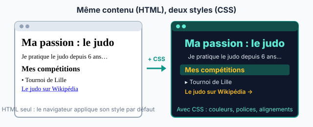

::: prof
**Mise en œuvre (vendredi 9 octobre, TP en demi-groupe, distanciel)** : déposer sur l'ENT ce PDF élève **et le fichier `editeur_web.html`** (dans le même dossier de sortie, `eleve/`). Créer un devoir « Ma première page web » qui accepte les fichiers `.html`. L'autre demi-groupe fera ce TP à sa prochaine séance de TP.

**L'éditeur** est un simple fichier HTML, sans compte ni installation. Il fonctionne même sans connexion, sauf pour les images prises sur Internet. Il garde le travail dans le navigateur de l'élève et le bouton « Télécharger ma page » produit un fichier `page_NOM_Prenom.html`. Le bouton « Ouvrir une page… » permet de reprendre un fichier déjà téléchargé. **Le tester une fois avant de le diffuser.** Sur téléphone, l'ouverture d'un fichier HTML téléchargé dépend du navigateur (à vérifier) : prévoir de laisser l'élève finir au lycée.

**Correction** : ouvrir chaque fichier déposé dans Chrome (double-clic) pour voir la page, puis clic droit → « Afficher le code source » pour lire le code. Le sujet est choisi par l'élève et le code de chaque page est personnel : deux pages identiques se repèrent tout de suite.

**Note de travail** : coefficient réduit, conformément à ce qui a été annoncé aux élèves. La note du thème Internet reste l'interrogation sur table (sujets A/B) faite au retour en classe.
:::

## Étape 1 — Ouvrir l'éditeur (5 min)

1. Sur l'ENT, télécharge le fichier **`editeur_web.html`**, puis ouvre-le **par un double-clic**. Il s'ouvre dans ton navigateur (Chrome, Firefox ou Edge).
2. Écris ton **nom** et ton **prénom** en haut de l'éditeur.
3. Repère les trois zones : l'onglet **HTML (contenu)**, l'onglet **CSS (style)** et l'**aperçu** de ta page, qui se met à jour pendant que tu tapes.

::: attention
Ton travail est gardé dans ce navigateur, mais **pense à cliquer sur « Télécharger ma page » à la fin** : c'est ce fichier que tu déposes sur l'ENT. Pour continuer plus tard, ouvre l'éditeur et clique sur « Ouvrir une page… ».
:::

## Étape 2 — Comprendre : contenu et style (10 min)

::: figure Le HTML décrit le contenu, le CSS décrit le style
{width=90%}
:::

::: doc DR1 | Les balises HTML essentielles (onglet HTML)
Une **balise** encadre un contenu pour dire **ce que c'est** : `<p>` ouvre un paragraphe, `</p>` le ferme.

| Balise | Rôle | Exemple |
| :--- | :--- | :--- |
| `<h1>…</h1>` | titre principal (un seul par page) | `<h1>Ma passion : le judo</h1>` |
| `<h2>…</h2>` | sous-titre | `<h2>Mes compétitions</h2>` |
| `<p>…</p>` | paragraphe | `<p>Je pratique depuis 6 ans.</p>` |
| `<ul>` et `<li>` | liste à puces, un `<li>` par élément | `<ul><li>Tournoi de Lille</li></ul>` |
| `<strong>…</strong>` | mot important (en gras) | `<strong>ceinture noire</strong>` |
| `<a href="URL">…</a>` | **lien hypertexte** vers l'URL | `<a href="https://fr.wikipedia.org/wiki/Judo">Le judo</a>` |
| `` | image (`alt` : description si l'image ne s'affiche pas) | `` |
:::

::: doc DR2 | Les propriétés CSS essentielles (onglet CSS)
Une règle CSS dit **à quelles balises** elle s'applique, puis **comment** les afficher :

```css
h1 {
  color: darkblue;
  text-align: center;
}
```

| Propriété | Effet | Exemples de valeurs |
| :--- | :--- | :--- |
| `color` | couleur du texte | `red`, `darkblue`, `#0d9488` |
| `background-color` | couleur du fond | `lightyellow`, `#f1f5f9` |
| `font-family` | police | `Arial`, `Georgia`, `"Comic Sans MS"` |
| `font-size` | taille du texte | `18px`, `2em` |
| `text-align` | alignement | `left`, `center`, `right` |
| `border` | bordure | `2px solid black` |
| `width` | largeur (utile pour les images) | `300px`, `50%` |
:::

Teste : dans l'onglet CSS, remplace `black` par `red` dans la règle `h1`. Le titre change de couleur, **sans que tu aies touché au HTML**.

## Étape 3 — Construire ma page en HTML (25 min)

Choisis **ton sujet** : un sport, un loisir, un jeu, un artiste, un métier, ta ville… Dans l'onglet HTML, remplace les `TODO` du code de départ, puis ajoute les éléments demandés.

::: question 1 [4 pt]
**Structure** : un titre `<h1>` personnalisé, **au moins deux** sous-titres `<h2>` et, sous chacun, **un paragraphe** `<p>` d'au moins deux phrases écrites par toi. Mets au moins un mot important en `<strong>`.
:::

::: reponse 0
Grille : `<h1>` personnalisé (1 pt) ; deux `<h2>` (1 pt) ; deux paragraphes `<p>` rédigés personnellement, sans copier-coller (1 pt) ; un `<strong>` (0,5 pt) ; balises correctement ouvertes et fermées, page qui s'affiche correctement (0,5 pt). Exemple :

```html
<h1>Ma passion : le judo</h1>
<p>Je m'appelle Lina et je pratique le <strong>judo</strong> depuis 6 ans.</p>
<h2>Pourquoi j'aime ce sport</h2>
<p>Le judo apprend le respect de l'adversaire. Chaque cours commence par un salut.</p>
<h2>Mes compétitions</h2>
<p>Je participe aux tournois de la région. Mon meilleur résultat : une médaille de bronze.</p>
```
:::

::: question 2 [2 pt]
**Liste** : ajoute une liste à puces `<ul>` d'**au moins trois** éléments `<li>` (tes matchs, tes albums préférés, ton matériel…).
:::

::: reponse 0
`<ul>` contenant au moins trois `<li>` (1 pt), bien imbriqués et fermés (1 pt).

```html
<ul>
  <li>Tournoi de Lille</li>
  <li>Championnat du Nord</li>
  <li>Open de Dunkerque</li>
</ul>
```
:::

::: question 3 [3 pt]
**Liens hypertextes** : ajoute **deux liens** `<a href="…">` qui fonctionnent. L'un mène à la page Wikipédia de ton sujet, l'autre à un **autre site** en rapport avec ton sujet. Le texte cliquable doit dire où mène le lien (pas « cliquez ici »).
:::

::: reponse 0
Deux liens `<a href>` avec une URL complète commençant par `https://` (1 pt chacun), qui fonctionnent quand on clique dans l'aperçu ; texte du lien explicite (1 pt).

```html
<p>Pour en savoir plus : <a href="https://fr.wikipedia.org/wiki/Judo">le judo sur Wikipédia</a>
et le <a href="https://www.ffjudo.com">site de la Fédération française de judo</a>.</p>
```
L'URL de la fédération est donnée à titre d'exemple : vérifier seulement que les liens des élèves fonctionnent.
:::

::: question 4 [3 pt]
**Image** : ajoute **une image** avec ``. Prends-la sur **Wikimedia Commons** (`commons.wikimedia.org`), où les images sont libres d'utilisation à condition de citer l'auteur. Pour avoir l'adresse de l'image, fais un clic droit sur l'image, puis « Copier l'adresse de l'image ». **Sous l'image**, écris dans un paragraphe son **auteur** et sa **licence** (indiqués sur la page Commons).
:::

::: reponse 0
`` avec un `src` qui s'affiche (1 pt) ; un `alt` qui décrit l'image (1 pt) ; auteur et licence cités sous l'image (1 pt). Cette question prépare la partie « notions juridiques » du thème (WEB.2, traitée plus tard).

```html

<p>Photo : NOM DE L'AUTEUR, licence CC BY-SA 4.0, Wikimedia Commons.</p>
```
:::

## Étape 4 — Habiller ma page en CSS (10 min)

::: question 5 [4 pt]
Dans l'onglet **CSS**, donne un style à ta page avec **au moins quatre propriétés différentes** du DR2, dont **obligatoirement** :

- une couleur de fond (`background-color`) pour la page (`body`) ;
- une couleur pour les titres `h1` **et** `h2`.

Toutes les règles de style doivent être dans l'onglet CSS, aucune dans le HTML.
:::

::: reponse 0
`background-color` sur `body` (1 pt) ; `color` sur `h1` et sur `h2` (1 pt) ; au moins quatre propriétés différentes au total (1 pt) ; aucun style écrit dans le HTML (pas d'attribut `style=` ni de `<font>`), page lisible avec un bon contraste (1 pt).

```css
body {
  font-family: Arial, sans-serif;
  background-color: #f1f5f9;
}
h1 {
  color: darkblue;
  text-align: center;
}
h2 {
  color: #0d9488;
  border-bottom: 2px solid #0d9488;
}
img {
  width: 300px;
}
```
:::

## Étape 5 — Répondre dans ma page, puis déposer (5 min)

Tout en bas de ta page, dans l'onglet HTML, ajoute un sous-titre `<h2>Mes réponses</h2>` puis **un paragraphe par question**.

::: question 6 [3 pt]
**a)** Dans une page web, quel langage décrit le **contenu** et lequel décrit le **style** ?

**b)** Si tu veux que tous tes sous-titres deviennent verts, dans quel onglet fais-tu la modification, et que modifies-tu ?

**c)** Qu'est-ce qu'un **lien hypertexte** ? Quelle balise permet d'en créer un ?
:::

::: reponse 0
**a)** Le **HTML** décrit le contenu (titres, paragraphes, liens, images) ; le **CSS** décrit le style (couleurs, polices, alignements). (1 pt)

**b)** Dans l'onglet **CSS** : la règle `h2 { color: green; }`. Le HTML ne change pas. (1 pt)

**c)** Un texte ou une image sur lequel on clique pour aller vers une autre ressource (page, site, image…) ; balise `<a href="URL">`. (1 pt)
:::

::: question 7 [1 pt]
**Dépôt** : clique sur **« Télécharger ma page »**, puis dépose le fichier `page_NOM_Prenom.html` dans le devoir de l'ENT.
:::

::: reponse 0
Fichier déposé dans les délais, au bon nom, qui s'ouvre et s'affiche correctement. (1 pt)
:::

::: retenir
- Une page web est écrite en [[HTML]] : des balises décrivent le **contenu** (titres, paragraphes, listes, liens, images).
- Le [[CSS]] décrit le **style** : couleurs, polices, alignements. On peut changer tout le style sans toucher au contenu.
- Un lien hypertexte s'écrit avec la balise [[a]] et son attribut `href`, qui contient l'[[URL]] de destination.
:::

## Barème

| Critère | Question | Points |
| :--- | :--- | :---: |
| Structure : titres et paragraphes personnels | Q1 | 4 |
| Liste à puces | Q2 | 2 |
| Deux liens hypertextes fonctionnels et explicites | Q3 | 3 |
| Image avec texte alternatif, auteur et licence | Q4 | 3 |
| Style en CSS séparé du contenu | Q5 | 4 |
| Réponses : contenu ou style, lien hypertexte | Q6 | 3 |
| Dépôt conforme | Q7 | 1 |
| **Total** | | **20** |
