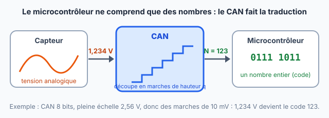
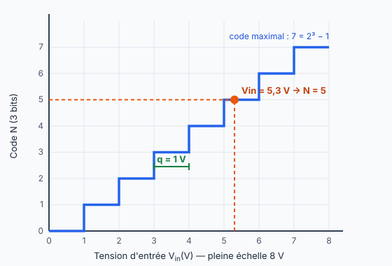

::: prof
**Mise en œuvre (vendredi 9 octobre, distanciel)** : la même fiche sert pour **TSTI2D1** (heure du midi) et pour l'**heure commune TSTI2D2 + TSTI2D3**. Déposer sur l'ENT ce PDF élève, le document réponse `REPONSES_AUTO_TermSIN_CAN_PasAPas.docx` et le simulateur `simulateur_can.html` (dossier `eleve/`), dans un devoir « CAN pas à pas » qui accepte les fichiers .docx, .odt et les photos.

**Intention** : remédiation. Le cours est allé vite ; ici, une seule idée par étape, un exemple entièrement résolu, puis des exercices que l'élève **vérifie lui-même** avec le simulateur (bouton « Masquer les résultats » pour s'entraîner). Les valeurs sont **différentes** de celles des interrogations A/B et du TP TMP36.

**Convention** : $q = \dfrac{\text{PE}}{2^n}$ (celle des interrogations). Le simulateur l'indique en en-tête.

**Au retour en classe** : 5 minutes de questions sur les points qui ont bloqué (les dépôts montrent lesquels), puis l'interrogation CAN.
:::

::: info Comment répondre et rendre ton travail
**Avant de commencer**, télécharge sur l'ENT le **simulateur** (`simulateur_can.html`) et ouvre-le par un double-clic : il s'ouvre dans ton navigateur, sans compte et sans installation. Garde-le ouvert à côté de cette fiche.

Pour tes réponses, **deux possibilités**, au choix :

1. **À l'ordinateur (conseillé)** : ouvre le fichier **`REPONSES_AUTO_TermSIN_CAN_PasAPas.docx`** avec Word ou LibreOffice Writer. Toutes les questions y sont déjà écrites. Enregistre-le sous le nom **`REPONSES_NOM_Prenom`** et dépose-le sur l'ENT.
2. **Dans ton cahier** : écris la date, le titre et le **numéro de chaque question**, puis dépose des **photos nettes**, une par page.

**Dans les deux cas** : écris tes **calculs** (formule, puis valeurs, puis résultat avec son unité), pas seulement le résultat. Une réponse que tu n'as pas trouvée s'écrit « je n'ai pas trouvé » : c'est mieux qu'une case vide.
:::

## Étape 1 — À quoi sert un CAN ? (5 min)

::: contexte Un problème de traduction
Un capteur (température, lumière, CO₂…) fournit une **tension**, qui peut prendre **n'importe quelle valeur** : 1,234 V, 1,2345 V… C'est une grandeur **analogique**.

Un microcontrôleur (Arduino, ESP32) ne sait manipuler que des **nombres entiers** écrits en binaire. Il faut donc un traducteur : le **convertisseur analogique-numérique (CAN)**. Il reçoit une tension et rend un **nombre entier $N$**, appelé **code**.

Pense à une **règle graduée en centimètres** : une hauteur de 1,734 m se lit « 173 cm ». On perd ce qui est plus petit qu'une graduation. Le CAN fait pareil : ses « graduations » s'appellent le **quantum** $q$.
:::

::: figure La chaîne d'acquisition
{width=95%}
:::

::: question 1
Pour un CAN, recopie et complète : « La grandeur d'**entrée** est … ; la grandeur de **sortie** est … ».
:::

::: reponse 0
L'entrée est une **tension analogique** ; la sortie est un **nombre entier** (code numérique $N$, écrit en binaire).
:::

## Étape 2 — Les marches de l'escalier : n bits et quantum q (15 min)

::: retenir
**Idée 1 — Un CAN de $n$ bits fournit $2^n$ codes différents**, de $N = 0$ à $N = 2^n - 1$.

**Idée 2 — Il découpe sa pleine échelle PE en $2^n$ marches identiques.** La hauteur d'une marche est le **quantum** :
$$q = \frac{\text{PE}}{2^n}$$
C'est la plus petite variation de tension que le CAN peut « voir ».
:::

::: info Exemple résolu
**CAN de 3 bits, pleine échelle PE = 8 V.**

- Nombre de codes : $2^3 = 8$ codes, de $N = 0$ à $N = 7$.
- Quantum : $q = \dfrac{8\text{ V}}{8} = 1\text{ V}$. Le CAN coupe 8 V en 8 marches de 1 V.

**Dans le simulateur** : règle 3 bits et PE = 8 V. Compte les marches de l'escalier : il y en a bien 8, et chacune mesure 1 V de large.
:::

::: figure Caractéristique de transfert du CAN 3 bits, pleine échelle 8 V
{width=72%}
:::

::: question 2
Recopie et complète le tableau.

| Nombre de bits $n$ | 1 | 2 | 4 | 8 | 10 | 12 |
| :--- | :---: | :---: | :---: | :---: | :---: | :---: |
| Nombre de codes $2^n$ | | | | | | |
| Code maximal $2^n - 1$ | | | | | | |
:::

::: reponse 0
| $n$ | 1 | 2 | 4 | 8 | 10 | 12 |
| :--- | :---: | :---: | :---: | :---: | :---: | :---: |
| $2^n$ | 2 | 4 | 16 | 256 | 1 024 | 4 096 |
| $2^n - 1$ | 1 | 3 | 15 | 255 | 1 023 | 4 095 |
:::

::: question 3
Calcule le quantum $q$ de chaque CAN, en écrivant la formule puis le calcul. Vérifie ensuite avec le simulateur.

**a)** 4 bits, PE = 8 V

**b)** 8 bits, PE = 2,56 V (donne le résultat en mV)

**c)** 12 bits, PE = 4,096 V (donne le résultat en mV)

**d)** Entre **b** et **c**, quel CAN est le plus précis ? Pourquoi ?
:::

::: reponse 0
**a)** $q = \dfrac{8}{2^4} = \dfrac{8}{16} = 0{,}5\text{ V}$.

**b)** $q = \dfrac{2{,}56}{2^8} = \dfrac{2{,}56}{256} = 0{,}01\text{ V} = 10\text{ mV}$.

**c)** $q = \dfrac{4{,}096}{2^{12}} = \dfrac{4{,}096}{4\,096} = 0{,}001\text{ V} = 1\text{ mV}$.

**d)** Le CAN **c** : son quantum est plus petit (1 mV contre 10 mV), donc il distingue des variations de tension plus fines.
:::

## Étape 3 — De la tension au code, et retour (15 min)

::: retenir
**Pour trouver le code $N$** : on compte combien de marches **entières** la tension a montées.
$$N = \text{partie entière de } \frac{V_{in}}{q}$$
On **ne prend pas l'arrondi** : on garde seulement la partie avant la virgule (5,3 donne 5 ; 5,9 donne aussi 5).

**Pour retrouver la tension** à partir du code : $V \approx N \times q$, à un quantum près.
:::

::: info Exemple résolu
**CAN de 3 bits, PE = 8 V, donc $q = 1$ V. Tension d'entrée $V_{in} = 5{,}3$ V.**

1. $\dfrac{V_{in}}{q} = \dfrac{5{,}3}{1} = 5{,}3$
2. Partie entière : $N = 5$.
3. Le code 5 représente $5 \times 1 = 5$ V : on a perdu 0,3 V. Cette **erreur de quantification** est toujours plus petite qu'un quantum.

C'est le point orange sur l'escalier de l'étape 2. **Dans le simulateur**, règle $V_{in}$ = 5,3 V et vérifie.
:::

::: question 4
CAN de **8 bits**, PE = **2,56 V** (son quantum a été calculé à la question 3b). Calcule le code $N$ pour :

**a)** $V_{in} = 1{,}234$ V

**b)** $V_{in} = 0{,}005$ V

**c)** $V_{in} = 2{,}56$ V. Attention : compare ton résultat au code maximal du tableau de la question 2, puis vérifie avec le simulateur.
:::

::: reponse 0
$q = 10$ mV $= 0{,}01$ V.

**a)** $\dfrac{1{,}234}{0{,}01} = 123{,}4$ donc $N = 123$.

**b)** $\dfrac{0{,}005}{0{,}01} = 0{,}5$ donc $N = 0$ : la tension est plus petite qu'un quantum, le CAN ne la « voit » pas.

**c)** $\dfrac{2{,}56}{0{,}01} = 256$, mais le code maximal d'un CAN 8 bits est **255** : le CAN donne $N = 255$ (il sature à la pleine échelle).
:::

::: question 5
Avec le même CAN (8 bits, PE = 2,56 V), le microcontrôleur lit le code $N = 181$. Quelle tension approximative y a-t-il à l'entrée ?
:::

::: reponse 0
$V \approx N \times q = 181 \times 0{,}01 = 1{,}81\text{ V}$ (la tension réelle est comprise entre 1,81 V et 1,82 V).
:::

## Étape 4 — Écrire le code en binaire et en hexadécimal (10 min)

::: info Exemple résolu : écrire N = 123 sur 8 bits
On remplit le tableau des **poids** de gauche à droite : à chaque case, si le poids « rentre » dans ce qui reste, on écrit **1** et on le retire ; sinon on écrit **0**.

| Poids | 128 | 64 | 32 | 16 | 8 | 4 | 2 | 1 |
| :--- | :---: | :---: | :---: | :---: | :---: | :---: | :---: | :---: |
| Bit | 0 | 1 | 1 | 1 | 1 | 0 | 1 | 1 |
| Reste | 123 | 59 | 27 | 11 | 3 | 3 | 1 | 0 |

$123 = 64 + 32 + 16 + 8 + 2 + 1$, donc $N$ = `0111 1011` en binaire.

**En hexadécimal**, on découpe en paquets de 4 bits : `0111` = 7 et `1011` = 11 = B. Donc $N$ = `0x7B`.

Rappel : en hexadécimal, 10 = A, 11 = B, 12 = C, 13 = D, 14 = E, 15 = F.
:::

::: question 6
Écris en binaire sur 8 bits, puis en hexadécimal, en détaillant le tableau des poids :

**a)** $N = 181$ (le code de la question 5)

**b)** $N = 37$

Vérifie avec le simulateur (8 bits) : il affiche les bits et leurs poids.
:::

::: reponse 0
**a)** $181 = 128 + 32 + 16 + 4 + 1$ → `1011 0101` → `1011` = B, `0101` = 5 → `0xB5`.

**b)** $37 = 32 + 4 + 1$ → `0010 0101` → `0x25`.
:::

## Étape 5 — Choisir son CAN, puis je fais le bilan (10 min)

::: info Méthode pour choisir le nombre de bits
1. Le capteur transforme la grandeur en tension, avec une **sensibilité** $s$ (par exemple 10 mV par °C).
2. Pour voir une variation de $\Delta T$, il faut un quantum plus petit que la variation de tension correspondante : $q \le s \times \Delta T$.
3. On cherche alors le plus petit $n$ tel que $\dfrac{\text{PE}}{2^n} \le q$, en essayant $n$ = 8, 10, 12…
:::

::: question 7
Un capteur de température fournit **10 mV par °C** (0 V à 0 °C). Il est relié au CAN 8 bits de pleine échelle 2,56 V.

**a)** Quelle variation de température ce CAN peut-il détecter au minimum ?

**b)** On veut détecter des variations de **0,25 °C**. Combien de bits faut-il au minimum, en gardant PE = 2,56 V ? Teste ta réponse dans le simulateur.
:::

::: reponse 0
**a)** $q = 10$ mV et le capteur donne 10 mV par °C, donc le CAN détecte des variations de **1 °C**.

**b)** Il faut $q \le 10 \times 0{,}25 = 2{,}5$ mV. Avec 8 bits : 10 mV (trop grand) ; 9 bits : 5 mV ; **10 bits** : $\dfrac{2{,}56}{1\,024} = 2{,}5$ mV, ce qui convient. Il faut **10 bits**.
:::

::: question 8
En une ou deux phrases : qu'est-ce qui n'était pas clair pour toi en cours et qui l'est maintenant ? Et qu'est-ce qui reste difficile ?
:::

::: reponse 0
Réponse personnelle. Elle sert à préparer les 5 minutes de questions au retour en classe.
:::

::: retenir
- Un CAN transforme une tension [[analogique]] en un nombre entier appelé [[code]].
- Un CAN de $n$ bits fournit [[2ⁿ]] codes, de 0 à $2^n - 1$.
- Le quantum vaut $q = \dfrac{\text{PE}}{2^n}$ : c'est la plus petite variation de tension que le CAN peut détecter. Plus il y a de bits, plus $q$ est [[petit]].
- Le code vaut $N$ = partie [[entière]] de $\dfrac{V_{in}}{q}$ ; l'erreur de quantification est toujours inférieure à un [[quantum]].
:::

Pour finir, **enregistre ton document réponse** (ou prends en photo les pages de ton cahier) et **dépose-le sur l'ENT**, dans le devoir « CAN pas à pas ».
