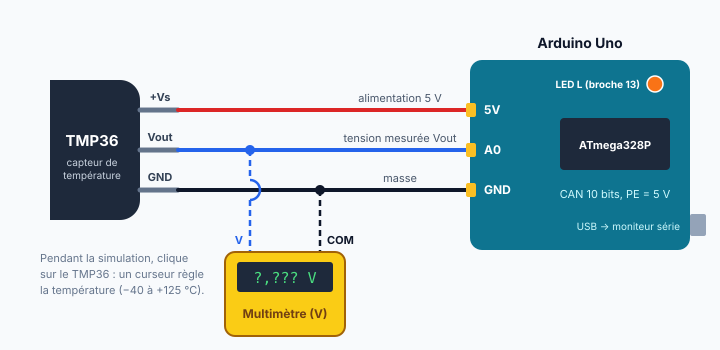

::: prof
**Mise en œuvre (vendredi 9 octobre, TSTI2D2, 3 h en distanciel)** : version individuelle et à distance du TP initialement prévu en binôme au labo. Les validations orales ✋ sont remplacées par **quatre captures d'écran** collées dans le document réponse (Q4, Q5, Q6, Q7). Déposer sur l'ENT ce PDF élève, le document réponse `REPONSES_AUTO_TermSIN_TMP36_Tinkercad.docx` et le programme de départ `station_temperature.ino` (dossier `eleve/`). Environ 2 h 45 de travail ; le reste du créneau sert de marge pour les soucis de connexion.

**Tinkercad** : les élèves de TSTI2D2 ont déjà un accès par la classe. Leurs circuits sont visibles depuis l'espace classe de l'enseignant (à vérifier : sinon, leur demander le lien de partage du circuit dans le dépôt).

**Correction** : la note s'appuie sur le document réponse (calculs, tableau, captures) et sur le circuit Tinkercad, qui sont personnels. Valeurs mesurées : le simulateur peut donner un code $N$ à ±1 près des valeurs du corrigé ; accepter si le raisonnement est juste.

**Les D1 et D3** n'ont pas d'accès Tinkercad : ce TP ne leur est pas destiné pour l'instant.
:::

::: info Comment répondre et rendre ton travail
1. Télécharge sur l'ENT le document réponse **`REPONSES_AUTO_TermSIN_TMP36_Tinkercad.docx`** et ouvre-le avec Word ou LibreOffice Writer. Toutes les questions y sont déjà écrites. Enregistre-le tout de suite sous le nom **`REPONSES_NOM_Prenom`**, puis enregistre régulièrement.
2. Télécharge aussi le programme de départ **`station_temperature.ino`** : tu l'ouvriras avec le Bloc-notes pour le copier dans Tinkercad (étape 4).
3. Aux étapes marquées **📸**, fais une **capture d'écran** (touches **Windows + Maj + S**, puis sélectionne la zone) et colle-la (**Ctrl + V**) dans ton document réponse, sous la question.
4. À la fin, dépose le document réponse sur l'ENT et vérifie que ton circuit Tinkercad est bien enregistré sous le nom **`TMP36_NOM_Prenom`**.

**Règles** : travail individuel ; les mesures et les captures doivent venir de **ton** circuit. Une réponse que tu n'as pas trouvée s'écrit « je n'ai pas trouvé » : c'est mieux qu'une case vide.
:::

## Étape 1 — Découvrir la situation (10 min)

::: contexte La salle serveur du lycée
Les serveurs du lycée (ENT, réseau pédagogique) sont regroupés dans une petite salle climatisée. Si la climatisation tombe en panne, la température monte vite et les serveurs risquent de s'arrêter. Le service informatique veut une **alerte dès que la température dépasse 27 °C**, et un **affichage de la température à 0,5 °C près**.

On prototype la solution dans **Tinkercad Circuits** avec une carte Arduino Uno et un capteur de température analogique TMP36.
:::

::: problematique
La chaîne capteur TMP36 + CAN de l'Arduino permet-elle de mesurer la température à 0,5 °C près ? Comment déclencher l'alerte ?
:::

::: figure Montage à réaliser dans Tinkercad

:::

:::: doc DR1 | Capteur de température TMP36 (extrait simplifié)
| Caractéristique | Valeur |
| :--- | :--- |
| Alimentation | 2,7 V à 5,5 V |
| Étendue de mesure | −40 °C à +125 °C |
| Tension de sortie | $V_{out} = 0{,}5\text{ V} + 0{,}01\text{ V/°C} \times T$ (soit 750 mV à 25 °C) |
| Précision typique | ±2 °C |
::::

:::: doc DR2 | CAN de la carte Arduino Uno
| Caractéristique | Valeur |
| :--- | :--- |
| Nombre de bits | 10 |
| Pleine échelle (référence par défaut) | 5 V |
| Fonction de lecture | `analogRead(A0)` renvoie le code $N$, de 0 à 1 023 |
::::

Connecte-toi à **Tinkercad** avec l'accès de la classe, puis crée un nouveau circuit (**Créer → Circuit**). Renomme-le tout de suite **`TMP36_NOM_Prenom`** (clic sur le nom, en haut à gauche).

## Étape 2 — Prévoir par le calcul (25 min)

::: question 1 [2 pt]
À l'aide du DR1, calculer la tension de sortie du TMP36 pour 20 °C, 27 °C, −40 °C et 125 °C.
:::

::: reponse 0
$V_{out} = 0{,}5 + 0{,}01 \times T$ : 20 °C → 0,70 V ; 27 °C → 0,77 V ; −40 °C → 0,10 V ; 125 °C → 1,75 V. (0,5 pt chacun)
:::

::: question 2 [2 pt]
Calculer le quantum $q$ du CAN de l'Arduino (DR2), puis la plus petite variation de température que la chaîne peut détecter. Le cahier des charges (affichage à 0,5 °C près) est-il respecté ?
:::

::: reponse 0
$q = \dfrac{5}{1\,024} \approx 4{,}88\text{ mV}$. (1 pt) Résolution en température : $\dfrac{q}{0{,}01\text{ V/°C}} \approx 0{,}49\text{ °C}$. Elle est inférieure à 0,5 °C, donc **c'est respecté, de justesse**. (1 pt)
:::

::: question 3 [1 pt]
Quel code $N$ le CAN doit-il fournir au seuil d'alerte de 27 °C ?
:::

::: reponse 0
$N = \dfrac{0{,}77}{0{,}004\,88} \approx 157{,}7$ → $N = 157$.
:::

## Étape 3 — Réaliser le montage et mesurer (30 min)

::: question 4 [2 pt]
Réaliser le montage dans Tinkercad : TMP36 alimenté en 5 V, sortie $V_{out}$ sur l'entrée **A0**, multimètre en voltmètre entre $V_{out}$ et GND. Lancer la simulation, cliquer sur le capteur pour régler la température sur **25 °C** et relever la tension affichée par le multimètre. Comparer à la valeur attendue.

📸 **Capture 1** : le montage en simulation, avec le réglage à 25 °C et la valeur du multimètre bien visibles.
:::

::: reponse 0
Multimètre : **0,750 V**, conforme au DR1 ($0{,}5 + 0{,}01 \times 25$). (1 pt montage visible et correct sur la capture, 1 pt mesure et comparaison)
:::

## Étape 4 — Programmer la conversion (30 min)

::: question 5 [4 pt]
Ouvre `station_temperature.ino` avec le Bloc-notes et copie tout le programme. Dans Tinkercad, clique sur **Code**, choisis le mode **Texte** et remplace tout le contenu par ce programme. Complète ensuite les zones `TODO Q5` pour calculer la tension `v`, puis la température `t`, à partir du code `n`. Lance la simulation et ouvre le **moniteur série** (en bas de la fenêtre de code).

```cpp
  // TODO Q5 : calculer la tension v (en V) a partir de n
  float v = 0;

  // TODO Q5 : calculer la temperature t (en degC) a partir de v
  float t = 0;
```

📸 **Capture 2** : tes deux lignes de calcul et le moniteur série qui affiche $N$, $V$ et $T$ pour 25 °C. **Copie aussi tes deux lignes** de code dans ta réponse.
:::

::: reponse 0
```cpp
  float v = n * PLEINE_ECHELLE / NB_CODES;   // tension en V
  float t = (v - 0.5) * 100.0;               // DR1 : T = (Vout - 0,5) / 0,01
```
2 pt pour chaque ligne. Pénaliser une division entière (`n / NB_CODES * 5`, qui donne 0) ; c'est l'occasion d'en expliquer la cause.
:::

## Étape 5 — Mesurer et analyser les écarts (25 min)

::: question 6 [4 pt]
Régler successivement le capteur aux températures du tableau. Relever le code $N$ et la température calculée par le programme, puis calculer l'écart. Conclure : l'écart est-il cohérent avec la résolution calculée en Q2 ?

| Température réglée (°C) | −10 | 0 | 25 | 27 | 50 |
| :--- | :---: | :---: | :---: | :---: | :---: |
| Code $N$ lu | | | | | |
| Température calculée (°C) | | | | | |
| Écart (°C) | | | | | |

📸 **Capture 3** : le moniteur série pour la mesure à 50 °C.
:::

::: reponse 0
| Température réglée (°C) | −10 | 0 | 25 | 27 | 50 |
| :--- | :---: | :---: | :---: | :---: | :---: |
| Code $N$ lu | 81 | 102 | 153 | 157 | 204 |
| Température calculée (°C) | −10,5 | −0,2 | 24,7 | 26,7 | 49,6 |
| Écart (°C) | −0,5 | −0,2 | −0,3 | −0,3 | −0,4 |

(2 pt mesures, 1 pt écarts) Les écarts sont tous **inférieurs à un quantum en température (0,49 °C)** : ils viennent de la quantification, la chaîne est cohérente. La mesure est toujours un peu inférieure, car le code est arrondi à l'entier inférieur. (1 pt conclusion)
:::

## Étape 6 — Déclencher l'alerte (15 min)

::: question 7 [2 pt]
Compléter la zone `TODO Q7` pour que la LED « L » de la carte s'allume au-dessus de 27 °C. Tester en faisant varier la température autour du seuil.

📸 **Capture 4** : la carte à 28 °C, LED « L » allumée, avec ton code de l'alerte visible. **Copie aussi ton code** dans ta réponse.
:::

::: reponse 0
```cpp
  if (t > SEUIL) {
    digitalWrite(PIN_ALARME, HIGH);
  } else {
    digitalWrite(PIN_ALARME, LOW);
  }
```
(1 pt code, 1 pt test visible sur la capture) Prolongement possible : seuil avec hystérésis pour éviter que la LED clignote autour de 27 °C.
:::

## Étape 7 — Améliorer la résolution (20 min)

::: question 8 [3 pt]
Le service informatique veut maintenant un affichage **à 0,1 °C près**.

**a)** En gardant une pleine échelle de 5 V, combien de bits faudrait-il au CAN au minimum ?

**b)** Proposer une autre solution qui ne change pas le nombre de bits.
:::

::: reponse 0
**a)** Il faut $q \le 0{,}1 \times 0{,}01 = 1\text{ mV}$, donc $\dfrac{5}{2^n} \le 0{,}001$, d'où $2^n \ge 5\,000$ et $n = 13$ bits ($2^{13} = 8\,192$). (2 pt)

**b)** **Réduire la pleine échelle** pour l'adapter à la plage utile. Entre 0 et 50 °C, $V_{out}$ reste sous 1 V : avec une référence de 1,1 V, $q = 1{,}1 / 1\,024 \approx 1{,}07\text{ mV}$, soit environ 0,1 °C. Autre réponse acceptée : **amplifier** le signal du capteur (conditionnement). (1 pt)
:::

## Étape 8 — Bilan et dépôt (10 min)

::: retenir
- Le CAN de l'Arduino est un CAN [[10]] bits de pleine échelle 5 V : son quantum vaut environ [[4,88 mV]].
- La résolution de la chaîne en température vaut $\dfrac{q}{s}$ : environ [[0,49 °C]] avec le TMP36.
- Pour améliorer la résolution : plus de [[bits]], une pleine échelle plus [[petite]], ou une amplification du signal.
:::

Pour finir : vérifie que les **4 captures** sont dans ton document réponse, **enregistre-le** et **dépose-le sur l'ENT**. Vérifie aussi que ton circuit Tinkercad s'appelle bien **`TMP36_NOM_Prenom`**.

## Barème & grille d'évaluation

| Compétence | Questions | Critères | Points |
| :--- | :--- | :--- | :---: |
| **CO7.3-SIN1** — Expérimenter une chaîne d'acquisition | Q1 à Q4, Q6 | Calculs justes et justifiés, montage fonctionnel (capture 1), mesures relevées, écarts expliqués par la quantification | 11 |
| **CO5.8-SIN2** — Programmer la réponse logicielle | Q5, Q7 | Conversion code → tension → température juste (pas de division entière), alerte fonctionnelle (captures 2 et 4) | 6 |
| **CO7.2** — Valider et proposer une amélioration | Q8 | Nombre de bits justifié, solution alternative pertinente | 3 |
| **Total** | | | **20** |
