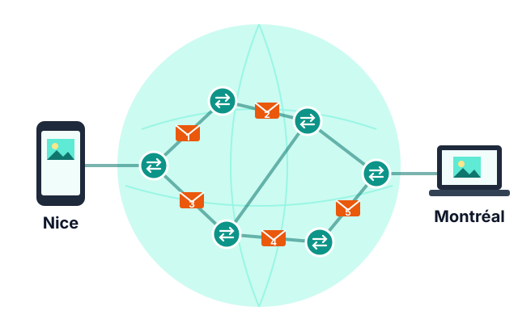
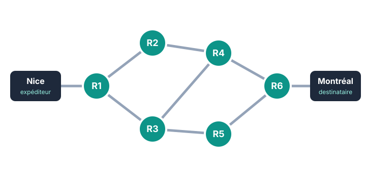
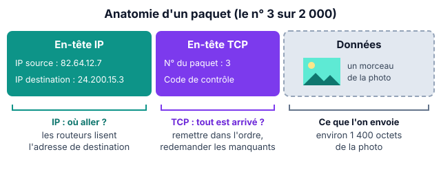
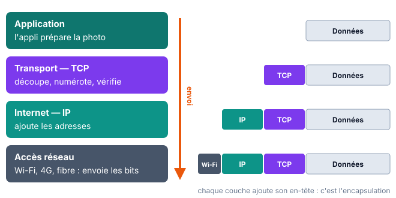

::: prof
Séance conçue pour un demi-groupe de 15 à 18 élèves. Les questions des activités 1 et 5 sont **projetées** : réponse à main levée, ou sur ardoise si la classe en a. Les élèves cochent aussi sur leur fiche.
:::

## Se poser la question

::: slide 3 min | Une photo, de Nice à Montréal
{width=70%}

> Vous envoyez une photo de **3 Mo** à un ami à Montréal, à plus de 6 000 km. Elle arrive en **moins d'une seconde**. Comment fait-elle ?
:::

::: dire
- Lire la question, laisser **30 secondes** de réflexion silencieuse.
- Recueillir 2 ou 3 hypothèses **sans les valider** : on y reviendra à la fin de la séance.
:::

::: activite 4 min | Ce que je sais déjà | individuel | projeter
Répondez à main levée, puis cochez votre réponse sur la fiche. Pas de note : c'est pour savoir d'où l'on part.
:::

::: question 1
Internet, c'est…

- [ ] un logiciel installé sur l'ordinateur
- [x] un réseau de réseaux qui relie des machines du monde entier
- [ ] la même chose que le Web
- [ ] un câble unique qui traverse l'océan
:::

::: reponse 0
Un **réseau de réseaux**. Le Web n'est qu'un service qui utilise Internet (comme le mail ou les jeux en ligne). Il y a bien des câbles sous-marins, mais des centaines, pas un seul.
:::

::: question 2
Une photo envoyée sur Internet voyage…

- [ ] en un seul bloc, d'un coup
- [x] découpée en petits morceaux
- [ ] uniquement par satellite
:::

::: reponse 0
**Découpée en petits morceaux** : les paquets. C'est le sujet de la séance.
:::

::: question 3
Une adresse IP sert à…

- [ ] protéger un ordinateur contre les virus
- [x] identifier une machine sur le réseau
- [ ] mesurer la vitesse de la connexion
:::

::: reponse 0
**Identifier une machine** sur le réseau, comme une adresse postale.
:::

::: dire
Ne pas corriger en détail : noter au tableau le nombre de bonnes réponses par question, on comparera au quiz de sortie.
:::

## Découper et envoyer : les paquets

::: slide 4 min | Internet : un réseau de réseaux

|||

- Des **milliards de machines** reliées.
- Des **routeurs** relient les réseaux entre eux.
- **Aucune machine centrale** ne commande tout.
- Une photo ne part pas d'un bloc : elle est découpée en **paquets** d'environ 1 500 octets.
:::

::: dire
- Montrer qu'il existe **plusieurs chemins** entre Nice et Montréal : on y reviendra dans l'activité 4.
- Question à la classe : « Pourquoi découper plutôt qu'envoyer d'un coup ? » → si un morceau se perd, on ne renvoie que lui ; les morceaux de plusieurs utilisateurs peuvent partager les mêmes câbles.
- Transition : « Découper, c'est bien. Mais comment le destinataire va-t-il recoller les morceaux ? On va essayer. »
:::

::: activite 12 min | Le jeu des paquets | groupe
Votre groupe est l'**ordinateur destinataire**. Le professeur joue le rôle du **réseau** : il va vous livrer, un par un, les morceaux d'un message.

1. Reconstituez le message (5 min).
2. Répondez ensemble aux questions ci-dessous.
:::

::: prof
**Préparation (une enveloppe par groupe)** : écrire un message de 6 morceaux sur 6 bandes de papier, **sans numéro ni nom**. Exemple :
« RENDEZ-VOUS » · « DEVANT LE » · « CDI » · « À 12 H 30 » · « AVEC TON » · « CHARGEUR ».

**Pendant le jeu** :
- livrer les morceaux **dans le désordre** ;
- garder un morceau dans votre poche (paquet perdu) — « À 12 H 30 » est le plus parlant ;
- livrer un morceau d'un autre message à un groupe (erreur de destination).

Au bout de 5 min, demander à chaque groupe de lire son message à voix haute : les phrases incohérentes font émerger le besoin d'informations sur chaque morceau.
:::

::: question 4
Quelles difficultés avez-vous rencontrées pour reconstituer le message ?
:::

::: reponse 3
Les morceaux arrivent **dans le désordre** ; un morceau **manque** ; un morceau ne nous était **pas destiné** ; on ne sait pas **combien** de morceaux attendre.
:::

::: question 5
Quelles informations faudrait-il écrire sur chaque morceau pour que le destinataire s'en sorte à coup sûr ? Proposez-en au moins trois.
:::

::: reponse 4
- Le **numéro** du morceau (et le nombre total) → remettre dans l'ordre, détecter un manque.
- L'**adresse du destinataire** → le réseau sait où livrer.
- L'**adresse de l'expéditeur** → le destinataire peut répondre ou redemander.
:::

::: question 6
Un morceau n'est jamais arrivé. Que proposez-vous ?
:::

::: reponse 3
Le destinataire **signale** à l'expéditeur le numéro manquant (ou l'expéditeur attend une confirmation de réception pour chaque morceau) et l'expéditeur le **renvoie**.
:::

::: dire
Mise en commun (3 min) : écrire au tableau les propositions des groupes en deux colonnes, sans les nommer encore — « adresses » d'un côté, « numéros / confirmation » de l'autre. La diapo suivante leur donne leur nom : IP et TCP.
:::

::: slide 5 min | IP et TCP : deux protocoles qui travaillent ensemble | fiche

- **IP** (*Internet Protocol*) : chaque machine a une **adresse IP**. Chaque paquet porte l'adresse de l'expéditeur et du destinataire ; les routeurs s'en servent pour l'acheminer.
- **TCP** (*Transmission Control Protocol*) : **numérote** les paquets, vérifie qu'ils sont tous arrivés grâce aux **accusés de réception**, **redemande** ceux qui manquent et remet le tout dans l'ordre.
:::

::: dire
- Faire le lien avec le tableau : colonne « adresses » = IP, colonne « numéros / confirmation » = TCP. **Ce sont vos idées** : les ingénieurs ont fait le même raisonnement dans les années 1970.
- Un **protocole** = un ensemble de règles que tout le monde respecte pour se comprendre.
:::

::: prof
Ne pas entrer dans le détail des ports ni de la poignée de main TCP : hors programme pour cette séance.
:::

:::: activite 7 min | Lire une adresse IP | binome
::: rappel Adresse IPv4
Une adresse IPv4 est formée de **4 nombres** compris entre **0 et 255**, séparés par des points. Exemple : `192.168.1.15`.
Chaque nombre tient sur un octet : l'adresse fait donc $4 \times 8 = 32$ bits.
:::
::::

::: question 7
Cochez les adresses IPv4 **valides**.

- [x] `192.168.1.15`
- [ ] `10.0.300.2`
- [ ] `172.16.4`
- [x] `8.8.8.8`
- [ ] `82.64.12.256`
:::

::: reponse 0
Valides : `192.168.1.15` et `8.8.8.8`. Invalides : `10.0.300.2` (300 > 255), `172.16.4` (seulement 3 nombres), `82.64.12.256` (256 > 255).
:::

::: question 8
Dans un réseau de lycée, avec le masque `255.255.255.0`, les **3 premiers nombres** désignent le réseau et le **dernier** désigne la machine. Les machines `192.168.1.15` et `192.168.1.42` sont-elles sur le même réseau ? Et `192.168.1.15` et `192.168.2.15` ?
:::

::: reponse 3
- `192.168.1.15` et `192.168.1.42` : **même réseau** (`192.168.1`), machines différentes (15 et 42).
- `192.168.1.15` et `192.168.2.15` : **réseaux différents** (`192.168.1` ≠ `192.168.2`) ; pour communiquer, il leur faut passer par un **routeur**.
:::

::: question 9
Un paquet transporte environ 1 500 octets. Combien de paquets faut-il, au minimum, pour envoyer la photo de 3 Mo ? (On prend 1 Mo = 1 000 000 octets.)
:::

::: reponse 3
$$\frac{3\,000\,000}{1\,500} = 2\,000 \text{ paquets}$$
En réalité un peu plus : chaque paquet transporte aussi ses en-têtes IP et TCP, qui prennent de la place.
:::

::: dire
Correction rapide à l'oral, en interrogeant un binôme par question. Insister sur l'ordre de grandeur : **2 000 paquets pour une seule photo**, qui arrivent en moins d'une seconde.
:::

## Trouver son chemin : le routage

::: slide 3 min | Les routeurs : des aiguilleurs
- Un **routeur** reçoit un paquet, lit l'**adresse IP de destination** et l'envoie vers le routeur suivant le plus adapté.
- Chaque routeur ne connaît que ses **voisins** : il consulte sa **table de routage**.
- Deux paquets d'une même photo peuvent prendre **des chemins différents**.
- On peut observer ce chemin avec la commande `traceroute` (`tracert` sous Windows).
:::

::: dire
Comparaison possible : un centre de tri postal ne connaît pas le trajet complet de la lettre, seulement le centre suivant vers la bonne ville.
:::

::: activite 7 min | Trouver le chemin | binome
Le schéma représente une petite partie d'Internet entre Nice et Montréal. Chaque cercle est un routeur, chaque trait une liaison.

:::

::: question 10
Donnez un chemin possible de Nice à Montréal. Combien de routeurs le paquet traverse-t-il ?
:::

::: reponse 3
Par exemple Nice → R1 → R2 → R4 → R6 → Montréal : **4 routeurs**. Autres chemins de même longueur : R1 → R3 → R4 → R6, et R1 → R3 → R5 → R6.
:::

::: question 11
Le routeur R4 tombe en panne. Le message peut-il encore arriver ? Par quel chemin ?
:::

::: reponse 3
**Oui** : Nice → R1 → R3 → R5 → R6 → Montréal. Les routeurs voisins de R4 constatent qu'il ne répond plus et envoient les paquets par un autre chemin.
:::

::: question 12
Quel routeur, s'il tombe en panne, coupe **complètement** Nice de Montréal ? Pourquoi Internet a-t-il été conçu avec de nombreux chemins ?
:::

::: reponse 4
**R1** (ou **R6**) : tous les chemins passent par lui. Internet a été conçu **sans centre** et avec de **nombreux chemins** possibles pour continuer à fonctionner même si une partie du réseau tombe en panne : c'est la **tolérance aux pannes**.
:::

::: dire
Correction au tableau en traçant les chemins sur la diapo projetée. Pour R1 / R6 : « Dans la vraie vie, votre box Internet est votre R1 : si elle tombe en panne, plus d'Internet à la maison. »
:::

## Faire le bilan

::: slide 2 min | Le modèle en couches | fiche

Chaque couche a **un rôle** et ajoute **ses informations** au paquet avant de le passer à la couche du dessous.
:::

::: dire
Rester simple : il suffit de retenir que chaque protocole a son rôle et qu'ils s'empilent. Le détail des couches sera revu au thème « Le Web ».
:::

::: retenir 5 min
- Sur Internet, les données sont découpées en [[paquets]] qui voyagent indépendamment les uns des autres.
- Le protocole [[IP]] donne une adresse à chaque machine ; les [[routeurs]] lisent l'adresse de destination pour acheminer chaque paquet.
- Une adresse IPv4 est formée de [[4]] nombres compris entre [[0]] et [[255]].
- Le protocole [[TCP]] numérote les paquets, vérifie leur arrivée grâce aux [[accusés de réception]] et redemande les paquets perdus.
- Comme il existe de nombreux chemins, Internet résiste aux [[pannes]].
- Les protocoles sont organisés en [[couches]] : chacune ajoute ses informations au paquet.
:::

::: dire
Les élèves complètent leur fiche pendant que la diapo est projetée. Revenir aux hypothèses de début de séance : lesquelles étaient justes ?
:::

::: activite 3 min | Quiz de sortie | individuel | projeter
Trois questions, réponse sur la fiche, puis à main levée.
:::

::: question 13
Qui remet les paquets dans le bon ordre à l'arrivée ?

- [ ] IP
- [x] TCP
- [ ] le routeur
- [ ] le Wi-Fi
:::

::: reponse 0
**TCP**, grâce aux numéros des paquets.
:::

::: question 14
`300.12.4.1` est-elle une adresse IPv4 valide ?

- [ ] oui
- [x] non
:::

::: reponse 0
**Non** : 300 dépasse 255.
:::

::: question 15
Un paquet se perd en route. Que se passe-t-il ?

- [ ] la photo arrive abîmée, tant pis
- [x] TCP le redemande à l'expéditeur
- [ ] le dernier routeur le recrée
:::

::: reponse 0
**TCP le redemande** : le destinataire n'a pas envoyé d'accusé de réception pour ce paquet, l'expéditeur le renvoie.
:::

::: dire
Comparer avec les résultats du quiz de début de séance (noter au tableau).
:::
