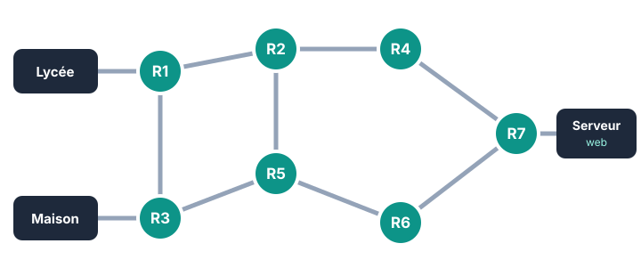

::: prof
**Mise en œuvre** : distribuer le sujet A et le sujet B en alternance selon les rangs. Les deux sujets ont la même structure, la même difficulté et le même barème ; seuls les exemples changent.
**Contenus évalués** : ceux vus en cours et en TP (séance TCP/IP, TP Filius, TP DNS / routage), soit INT.1 et INT.2. Le pair-à-pair et les réseaux physiques (INT.3, INT.4) ne sont pas évalués ici.
:::

## Partie 1 — Connaissances

:::: question 1 [4 pt]
Pour chaque question, cocher la bonne réponse.

::: variante A
**a)** Le protocole IP sert à…

- [ ] remettre les paquets dans le bon ordre
- [x] acheminer chaque paquet jusqu'à la bonne machine grâce aux adresses
- [ ] afficher les pages web

**b)** Un routeur…

- [x] choisit vers quel voisin envoyer chaque paquet
- [ ] stocke les sites web
- [ ] traduit les noms de domaine en adresses IP

**c)** Pour vérifier qu'une machine répond sur le réseau, on utilise la commande…

- [ ] `ipconfig`
- [x] `ping`
- [ ] `dns`

**d)** Une donnée envoyée sur Internet est découpée en…

- [ ] fichiers
- [x] paquets
- [ ] adresses
:::

::: variante B
**a)** Le protocole TCP sert à…

- [ ] donner une adresse à chaque machine
- [ ] choisir le chemin des paquets
- [x] vérifier que tous les paquets sont arrivés et les remettre dans l'ordre

**b)** Un serveur DNS…

- [ ] relie les câbles du réseau entre eux
- [x] traduit un nom de domaine en adresse IP
- [ ] accélère la connexion

**c)** La commande qui affiche la liste des routeurs traversés jusqu'à une destination est…

- [x] `traceroute` (`tracert` sous Windows)
- [ ] `ping`
- [ ] `ipconfig`

**d)** Un paquet contient…

- [ ] uniquement un morceau des données
- [x] les adresses de l'expéditeur et du destinataire, et un morceau des données
- [ ] le fichier complet
:::
::::

::: reponse 0
1 point par bonne réponse. {{IP : acheminer grâce aux adresses ; routeur : choisit le voisin ; `ping` ; paquets.|TCP : vérifier et remettre dans l'ordre ; DNS : nom → adresse IP ; `traceroute` ; adresses + morceau des données.}}
:::

::: question 2 [3 pt]
Une adresse IPv4 est formée de 4 nombres compris entre 0 et 255, séparés par des points. Cocher les adresses **valides**, puis justifier pour **une** adresse non valide.

- [{{x| }}] `{{172.16.10.4|256.10.1.1}}`
- [{{ |x}}] `{{192.168.1.300|192.168.0.25}}`
- [x] `{{10.0.0.1|172.20.4.1}}`
- [ ] `{{8.8.8|10.1.1.1.5}}`
:::

::: reponse 3
Valides : {{`172.16.10.4` et `10.0.0.1`|`192.168.0.25` et `172.20.4.1`}} (2 × 0,5 pt). Non valides : {{`192.168.1.300` (300 > 255) et `8.8.8` (seulement 3 nombres)|`256.10.1.1` (256 > 255) et `10.1.1.1.5` (5 nombres)}} (2 × 0,5 pt). Justification correcte : 1 pt.
:::

::: question 3 [3 pt]
Un élève tape la commande suivante sur son ordinateur :

```text
> nslookup {{www.lycee-exemple.fr|www.mediatheque-exemple.fr}}
Serveur :  box.home
Address :  192.168.1.1

Nom :      {{www.lycee-exemple.fr|www.mediatheque-exemple.fr}}
Address :  {{192.0.2.17|198.51.100.42}}
```

**a)** Quel est le rôle du serveur DNS interrogé ?

**b)** Quelle adresse IP le navigateur va-t-il contacter pour afficher le site ?
:::

::: reponse 4
**a)** Le serveur DNS **traduit le nom de domaine** (adresse symbolique, facile à retenir) **en adresse IP** (adresse numérique utilisée par le réseau). (1,5 pt)

**b)** `{{192.0.2.17|198.51.100.42}}`. (1,5 pt) Accepter une réponse qui cite la bonne ligne « Address » ; refuser `192.168.1.1`, qui est l'adresse du serveur DNS (la box).
:::

## Partie 2 — Routage

::: question 4 [5 pt]
Le schéma représente une partie d'Internet. Chaque cercle est un routeur, chaque trait une liaison.



**a)** Donner le chemin qui traverse **le moins de routeurs** pour aller {{du Lycée|de la Maison}} au Serveur web. Combien de routeurs traverse-t-il ?

**b)** Le routeur **{{R4|R5}}** tombe en panne. Le message peut-il encore arriver ? Si oui, par quel chemin ?

**c)** Quel routeur, s'il tombe en panne, empêche **tout** message d'aller {{du Lycée|de la Maison}} au Serveur web ? Justifier.
:::

::: reponse 4
**a)** {{Lycée → R1 → R2 → R4 → R7 → Serveur : **4 routeurs**.|Maison → R3 → R5 → R6 → R7 → Serveur : **4 routeurs**.}} (2 pt : 1 pour le chemin, 1 pour le nombre)

**b)** **Oui.** {{Par exemple Lycée → R1 → R2 → R5 → R6 → R7 → Serveur (ou R1 → R3 → R5 → R6 → R7) : 5 routeurs.|Par exemple Maison → R3 → R1 → R2 → R4 → R7 → Serveur : 5 routeurs.}} Les routeurs voisins envoient les paquets par un autre chemin. (2 pt)

**c)** **{{R1|R3}}** (ou **R7**) : tous les chemins passent par lui. (1 pt)
:::

## Partie 3 — TCP

::: question 5 [3 pt]
{{Une photo est découpée en 6 paquets numérotés de 1 à 6. Le paquet n° 4 n'arrive jamais. Que se passe-t-il ? Quel protocole s'en charge ?|Les paquets d'une vidéo arrivent dans l'ordre 1, 3, 2, 5, 4. Est-ce un problème pour afficher la vidéo correctement ? Quel protocole s'en charge, et grâce à quelle information ?}}
:::

::: reponse 4
{{Le destinataire ne confirme pas la réception du paquet n° 4 : l'expéditeur le **renvoie**. C'est le protocole **TCP** qui numérote les paquets, détecte le manque et redemande le paquet perdu.|Non : le protocole **TCP** remet les paquets **dans l'ordre** grâce à leur **numéro** avant de transmettre les données à l'application.}} (1 pt pour le protocole, 2 pt pour l'explication)
:::

::: question 6 [2 pt]
{{Lors d'un appel vidéo, l'image se fige parfois quelques secondes, alors qu'un courriel arrive toujours complet. Expliquer cette différence.|Dans un jeu en ligne, il arrive que le jeu « lag » (retard), alors qu'un fichier téléchargé arrive toujours complet. Expliquer cette différence.}}
:::

::: reponse 4
Internet et TCP **garantissent que les données arrivent complètes** (les paquets perdus sont redemandés), mais **pas quand elles arrivent** : il n'y a pas de garantie de délai. Pour {{un courriel|un fichier}}, un léger retard ne se voit pas ; pour {{une vidéo en direct|un jeu en temps réel}}, un retard se voit immédiatement. (2 pt)
:::
