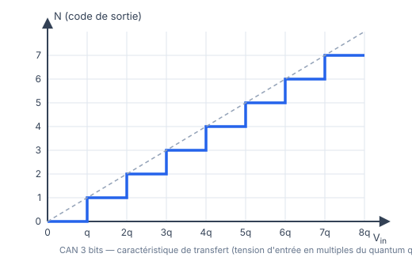

::: prof
**Mise en œuvre (vendredi 16 octobre)** : sujet **A** pour TSTI2D1 (1re heure), sujet **B** pour l'heure commune TSTI2D2 + TSTI2D3 (2e heure). Les deux sujets ont la même structure et le même barème ; les valeurs changent, ce qui neutralise la transmission des réponses entre les deux heures.

**Convention** : quantum $q = \dfrac{\text{PE}}{2^n}$ et code $N$ = partie entière de $\dfrac{V_{in}}{q}$, comme dans la documentation Arduino. Si le cours a utilisé $2^n - 1$, les résultats diffèrent de moins de 0,5 % : accepter les deux conventions si elles sont appliquées de façon cohérente.

**Contenus évalués (BO 2.4.2 / 5.3.1)** : grandeur d'entrée, grandeur de sortie, caractéristique de transfert, nombre de bits, résolution, quantum, valeur pleine échelle.
:::

## Partie 1 — Vocabulaire

:::: question 1 [3 pt]
Cocher la bonne réponse.

::: variante A
**a)** Le quantum d'un CAN est…

- [ ] le nombre de bits du convertisseur
- [x] la plus petite variation de la tension d'entrée qui fait changer le code de sortie
- [ ] la tension d'entrée maximale

**b)** Un CAN de $n$ bits peut fournir…

- [x] $2^n$ codes différents
- [ ] $n$ codes différents
- [ ] $2 \times n$ codes différents

**c)** La grandeur de sortie d'un CAN est…

- [ ] une tension
- [ ] un courant
- [x] un nombre binaire (code numérique)
:::

::: variante B
**a)** La valeur pleine échelle d'un CAN est…

- [x] l'étendue de la tension d'entrée que le CAN peut convertir
- [ ] le nombre de codes de sortie
- [ ] la plus petite variation de tension détectable

**b)** Si l'on ajoute 1 bit à un CAN de même pleine échelle, le quantum est…

- [ ] multiplié par 2
- [x] divisé par 2
- [ ] inchangé

**c)** La grandeur d'entrée d'un CAN est…

- [x] une tension analogique
- [ ] un nombre binaire
- [ ] une fréquence
:::
::::

::: reponse 0
1 point par bonne réponse. {{Quantum : plus petite variation qui change le code ; $2^n$ codes ; sortie = nombre binaire.|PE : étendue de la tension convertible ; quantum divisé par 2 ; entrée = tension analogique.}}
:::

## Partie 2 — Calculs

::: question 2 [4 pt]
Un CAN de **{{8|10}} bits** a une pleine échelle de **{{5|3,3}} V**.

**a)** Combien de codes différents peut-il fournir ? Quelles sont la plus petite et la plus grande valeur du code $N$ ?

**b)** Calculer son quantum $q$, en mV.
:::

::: reponse 4
**a)** $2^{ {{8|10}} } = {{256|1\,024}}$ codes, de $N = 0$ à $N = {{255|1\,023}}$. (2 pt)

**b)** $q = \dfrac{\text{PE}}{2^n} = \dfrac{ {{5|3{,}3}} }{ {{256|1\,024}} } \approx {{19{,}5|3{,}22}}\text{ mV}$ (valeur exacte {{19,53|3,223}} mV). (2 pt)
:::

::: question 3 [4 pt]
La tension d'entrée vaut $V_{in} = {{2{,}0|1{,}5}}\text{ V}$.

**a)** Calculer le code $N$ fourni par le CAN de la question 2.

**b)** Écrire ce code en binaire sur {{8|10}} bits, puis en hexadécimal.
:::

::: reponse 4
**a)** $N = \dfrac{V_{in}}{q} = \dfrac{ {{2{,}0|1{,}5}} }{ {{0{,}019\,53|0{,}003\,223}} } \approx {{102{,}4|465{,}4}}$, donc $N = {{102|465}}$ (partie entière). (2 pt)

**b)** {{$102 = 64 + 32 + 4 + 2$ → `0110 0110` → `0x66`|$465 = 256 + 128 + 64 + 16 + 1$ → `01 1101 0001` → `0x1D1`}}. (1 pt binaire, 1 pt hexadécimal)
:::

::: question 4 [3 pt]
Le CAN fournit le code $N$ = `{{0xC8|0x2EE}}`. Convertir ce code en décimal, puis calculer la tension d'entrée correspondante (valeur approchée).
:::

::: reponse 3
`{{0xC8|0x2EE}}` $= {{12 \times 16 + 8 = 200|2 \times 256 + 14 \times 16 + 14 = 750}}$. (1 pt)

$V_{in} \approx N \times q = {{200 \times 19{,}53\text{ mV} \approx 3{,}91\text{ V}|750 \times 3{,}223\text{ mV} \approx 2{,}42\text{ V}}}$. (2 pt)
:::

## Partie 3 — Caractéristique de transfert

::: question 5 [3 pt]
On étudie un CAN de **3 bits** dont la caractéristique de transfert est donnée ci-dessous ; son quantum vaut $q = {{0{,}5|0{,}25}}\text{ V}$.

{width=70%}

**a)** Quel code $N$ fournit-il pour $V_{in} = {{1{,}3|1{,}1}}\text{ V}$ ?

**b)** Quelle est l'erreur maximale commise entre la tension réelle et la tension représentée par le code ?

**c)** En déduire sa valeur pleine échelle.
:::

::: reponse 3
**a)** $\dfrac{ {{1{,}3|1{,}1}} }{ {{0{,}5|0{,}25}} } = {{2{,}6|4{,}4}}$ → $N = {{2|4}}$. (1 pt)

**b)** L'erreur de quantification est au plus égale à un quantum : {{0,5|0,25}} V. (1 pt)

**c)** $\text{PE} = 2^3 \times q = 8 \times {{0{,}5|0{,}25}} = {{4|2}}\text{ V}$. (1 pt)
:::

## Partie 4 — Choisir un CAN

::: question 6 [3 pt]
Un capteur de température fournit une tension de **0 V à 0 °C** jusqu'à **{{5 V à 100 °C|3,3 V à 50 °C}}** (relation linéaire). On veut distinguer des variations de **{{0,1|0,02}} °C**. La pleine échelle du CAN vaut {{5|3,3}} V.

Quel nombre de bits minimal faut-il ? Justifier par un calcul.
:::

::: reponse 4
Sensibilité du capteur : $s = {{\dfrac{5}{100} = 50\text{ mV/°C}|\dfrac{3{,}3}{50} = 66\text{ mV/°C}}}$.

Quantum maximal : $q \le s \times {{0{,}1|0{,}02}} = {{5|1{,}32}}\text{ mV}$. (1 pt)

$\dfrac{ {{5|3{,}3}} }{2^n} \le {{0{,}005|0{,}001\,32}}$ → $2^n \ge {{1\,000|2\,500}}$ → $n = {{10|12}}$ bits ($2^{ {{10|12}} } = {{1\,024|4\,096}}$). (2 pt)
:::
