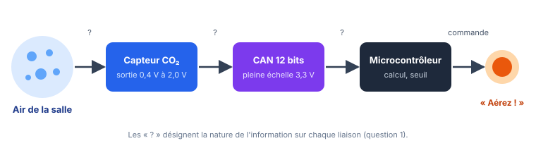

::: prof
**Mise en œuvre** : TSTI2D3, mardi 13 octobre (1 h). Ce TD sert aussi d'entraînement à l'évaluation du vendredi : ne pas rendre le corrigé avant le vendredi 16 au soir.
**Convention** : $q = \text{PE} / 2^n$, $N$ = partie entière de $V / q$.
:::

## 1. Contextualisation & Système Étudié

::: contexte Des capteurs de CO₂ dans les salles
Quand une classe est occupée, la concentration de dioxyde de carbone (CO₂) de l'air augmente : c'est un bon indicateur du besoin d'aérer. Le lycée équipe chaque salle d'un petit boîtier qui allume un voyant « Aérez ! » lorsque la concentration dépasse le **seuil d'alerte fixé par le lycée : 1 500 ppm** (parties par million).
:::

::: problematique
La chaîne d'acquisition du boîtier est-elle assez précise, et comment l'améliorer ?
:::

::: figure Chaîne d'information du boîtier

:::

:::: doc DR1 | Caractéristiques simplifiées du boîtier
| Constituant | Caractéristique |
| :--- | :--- |
| Capteur de CO₂ | Étendue de mesure : 0 à 5 000 ppm. Sortie analogique **linéaire** : 0,4 V pour 0 ppm, 2,0 V pour 5 000 ppm |
| CAN du microcontrôleur | 12 bits, pleine échelle 3,3 V |
| Voyant | Allumé si la concentration dépasse 1 500 ppm |
::::

## 2. Travail Demandé

::: question 1 [2 pt]
Sur le schéma, préciser la **nature de l'information** sur chaque liaison marquée « ? » (grandeur physique, tension analogique, nombre binaire…), avec son unité.
:::

::: reponse 4
- Air → capteur : **concentration de CO₂** (grandeur physique, en ppm). (0,5 pt)
- Capteur → CAN : **tension analogique** (en V), de 0,4 à 2,0 V. (0,5 pt)
- CAN → microcontrôleur : **nombre binaire** $N$ sur 12 bits (sans unité), de 0 à 4 095. (1 pt)
:::

::: question 2 [4 pt]
**a)** Calculer la sensibilité $s$ du capteur, en mV/ppm.

**b)** Calculer la tension de sortie du capteur pour 1 000 ppm, puis pour le seuil d'alerte de 1 500 ppm.
:::

::: reponse 5
**a)** $s = \dfrac{\Delta V}{\Delta C} = \dfrac{2{,}0 - 0{,}4}{5\,000 - 0} = 0{,}32\text{ mV/ppm}$. (2 pt)

**b)** $V = 0{,}4 + s \times C$ :
$V(1\,000) = 0{,}4 + 0{,}000\,32 \times 1\,000 = 0{,}72\text{ V}$ ;
$V(1\,500) = 0{,}4 + 0{,}000\,32 \times 1\,500 = 0{,}88\text{ V}$. (2 pt)
:::

::: question 3 [4 pt]
**a)** Calculer le quantum $q$ du CAN.

**b)** En déduire la plus petite variation de concentration de CO₂ que la chaîne peut détecter (résolution en ppm).
:::

::: reponse 4
**a)** $q = \dfrac{3{,}3}{2^{12}} = \dfrac{3{,}3}{4\,096} \approx 0{,}806\text{ mV}$. (2 pt)

**b)** $\Delta C_{min} = \dfrac{q}{s} = \dfrac{0{,}806}{0{,}32} \approx 2{,}5\text{ ppm}$. (2 pt)
:::

::: question 4 [4 pt]
**a)** Calculer le code $N$ fourni par le CAN au seuil d'alerte (1 500 ppm).

**b)** Écrire ce code en binaire sur 12 bits et en hexadécimal.
:::

::: reponse 4
**a)** $N = \dfrac{0{,}88}{0{,}000\,806} \approx 1\,092{,}3$ → $N = 1\,092$. (2 pt)

**b)** $1\,092 = 1\,024 + 64 + 4$ → `0100 0100 0100` → `0x444`. (1 pt + 1 pt)
:::

::: question 5 [3 pt]
**a)** Écrire l'expression qui permet au programme de calculer la concentration $C$ (en ppm) à partir du code $N$.

**b)** Le microcontrôleur lit $N = 2\,000$. Calculer la concentration correspondante et dire si le voyant doit s'allumer.
:::

::: reponse 4
**a)** $V = N \times q$ puis $C = \dfrac{V - 0{,}4}{s}$, soit $C = \dfrac{N \times q - 0{,}4}{0{,}000\,32}$. (1 pt)

**b)** $V = 2\,000 \times 0{,}000\,806 \approx 1{,}61\text{ V}$ ; $C = \dfrac{1{,}61 - 0{,}4}{0{,}000\,32} \approx 3\,790\text{ ppm}$ (3 785 ppm avec $q$ exact). (1 pt) $3\,790 > 1\,500$ : **le voyant s'allume**. (1 pt)
:::

::: question 6 [3 pt]
La sortie du capteur ne dépasse jamais 2,0 V alors que la pleine échelle du CAN vaut 3,3 V.

**a)** Quelle fraction de la pleine échelle est réellement utilisée ?

**b)** On ajoute entre le capteur et le CAN un **amplificateur** pour que 2,0 V devienne 3,3 V. Calculer son gain, puis la nouvelle résolution en ppm. Conclure.
:::

::: reponse 4
**a)** $\dfrac{2{,}0}{3{,}3} \approx 61\ \%$ : près de 40 % des codes ne servent jamais. (1 pt)

**b)** $G = \dfrac{3{,}3}{2{,}0} = 1{,}65$. (1 pt) La sensibilité vue par le CAN devient $1{,}65 \times 0{,}32 = 0{,}528\text{ mV/ppm}$, d'où une résolution $\dfrac{0{,}806}{0{,}528} \approx 1{,}5\text{ ppm}$. Le **conditionnement** (amplification) améliore la résolution sans changer de CAN. (1 pt)
:::

## 3. Bilan & Synthèse des Acquis

::: retenir
- Le quantum d'un CAN vaut $q = \dfrac{\text{PE}}{2^n}$ : c'est la plus petite variation de [[tension]] qui change le code.
- La résolution d'une chaîne de mesure s'exprime dans l'unité de la grandeur mesurée : $\dfrac{q}{s}$, où $s$ est la [[sensibilité]] du capteur.
- Pour utiliser toute la [[pleine échelle]] du CAN, on [[amplifie]] le signal du capteur : c'est le conditionnement.
:::

## 4. Barème & Grille d'Évaluation

| Question | Compétence évaluée | Points |
| :--- | :--- | :---: |
| Q1 | CO3.1 — Identifier les entrées / sorties et la nature de l'information | 2 |
| Q2, Q3 | CO7.3-SIN1 — Caractériser un capteur et un CAN | 8 |
| Q4 | 2.4.3a — Encodage binaire / hexadécimal | 4 |
| Q5 | Exploiter la chaîne : du code à la grandeur physique | 3 |
| Q6 | 2.4.2b — Justifier un conditionnement | 3 |
| **Total** | | **20** |
