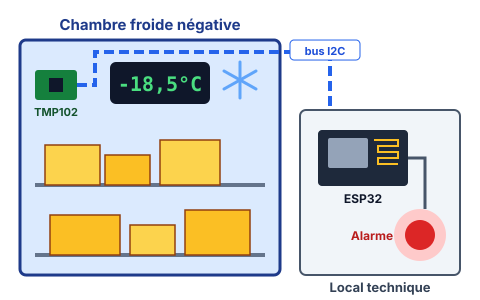
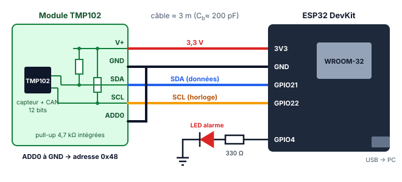
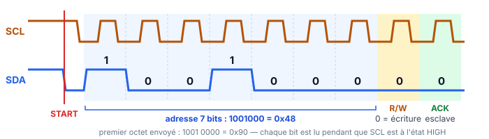
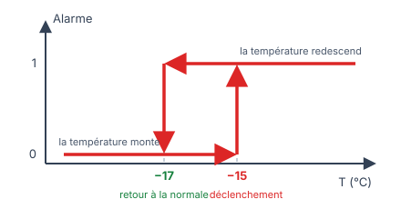

## 0. En-tête pédagogique

| Rubrique | Contenu |
| :--- | :--- |
| **Classe** | Terminale STI2D — Spécialité 2I2D, option SIN |
| **Durée** | $3\text{ h}$ (binômes) |
| **Prérequis** | Chaîne d'information, numération binaire/hexadécimale, bases de programmation C/C++ Arduino (variables, fonctions, `if`) |
| **Matériel par binôme** | 1 carte ESP32 DevKit (WROOM-32) + câble USB · 1 module TMP102 (avec résistances de tirage $4{,}7\text{ k}\Omega$ intégrées) · 1 plaque d'essai + fils · 1 LED rouge + résistance $330\text{ }\Omega$ · 1 analyseur logique USB 8 voies (logiciel PulseView) · 1 thermomètre de référence · 1 bécher eau + glace pilée |
| **Logiciels** | Arduino IDE 2.x avec le gestionnaire de cartes « esp32 by Espressif », PulseView (décodeur I2C) |
| **Documents ressources** | DR1 : extrait de documentation TMP102 · DR2 : format du registre de température · DR3 : rappel sur le bus I2C |

**Compétences visées (programme 2I2D, BO spécial n°1 du 22 janvier 2019 — `referentiels/referentiel_term_sti2d_sin.md`) :**

| Code | Compétence | Questions |
| :--- | :--- | :--- |
| **CO5.8-SIN1** | Concevoir — Proposer/choisir l'architecture d'une solution logicielle et matérielle au regard de la définition d'un produit. | Q1 à Q4 |
| **CO7.3-SIN1** | Expérimenter — Des moyens matériels d'acquisition, de traitement, de stockage et de restitution de l'information pour aider à la conception d'une chaîne d'information. | Q5, Q7, Q8 |
| **CO3.3** | Identifier et caractériser le fonctionnement temporel d'un produit ou d'un processus. | Q6 |
| **CO5.8-SIN2** | Concevoir — Rechercher et écrire l'algorithme de fonctionnement puis programmer la réponse logicielle relative au traitement d'une problématique posée. | Q9, Q10 |
| **CO7.2** | Mettre en œuvre un scénario de validation devant intégrer un protocole d'essais, de mesures et/ou d'observations sur le prototype ou la maquette, interpréter les résultats et qualifier le produit. | Q11, Q12 |

**Connaissances associées** : 5.3.4b Caractéristiques des bus de communication · 3.4.3a Typologies des communications · 3.4.3b Liaisons séries · 2.4.2c Conversion analogique/numérique · 2.4.3a Encodage de l'information · 3.4.4b Contrôle d'un système régulé · 6.2a Protocole d'essai.

---

## 1. Contextualisation & Système Étudié

::: contexte La chambre froide de la cuisine centrale


La cuisine centrale du lycée stocke ses produits surgelés dans une **chambre froide négative**. La réglementation sanitaire (méthode **HACCP**, arrêté du 21 décembre 2009) impose de conserver les produits surgelés à une température **inférieure ou égale à $-18\text{ °C}$**, une remontée ponctuelle jusqu'à $-15\text{ °C}$ étant tolérée lors des manipulations.

Aujourd'hui, la température est relevée **à la main deux fois par jour** sur un thermomètre à aiguille. Le mois dernier, une porte mal fermée un vendredi soir a provoqué la perte de plus de $800\text{ €}$ de marchandises : la dérive n'a été découverte que le lundi matin.
:::

::: problematique
Comment acquérir en continu la température de la chambre froide avec une précision suffisante, et déclencher une alarme fiable dès que la limite réglementaire est dépassée ?
:::

### 1.2 La solution étudiée

L'équipe technique propose un **module de supervision** basé sur :

* un capteur de température numérique **TMP102** (Texas Instruments) placé dans la chambre froide ;
* un microcontrôleur **ESP32** qui interroge le capteur via le **bus I2C**, traite la mesure et pilote un voyant d'alarme ;
* (TP suivant) une remontée des mesures en Wi-Fi vers un tableau de bord MQTT.

::: figure Synoptique du module de supervision

:::

### 1.3 Documents ressources

:::: doc DR1 | Extrait de la documentation du TMP102
| Caractéristique | Valeur |
| :--- | :--- |
| Tension d'alimentation | $1{,}4\text{ V}$ à $3{,}6\text{ V}$ |
| Plage de mesure | $-40\text{ °C}$ à $+125\text{ °C}$ |
| Précision | $\pm 0{,}5\text{ °C}$ de $-25\text{ °C}$ à $+85\text{ °C}$ ; $\pm 1\text{ °C}$ de $-40\text{ °C}$ à $+125\text{ °C}$ |
| Résolution | 12 bits, $0{,}0625\text{ °C}$ par LSB |
| Interface | I2C / SMBus, sorties SDA en **drain ouvert**, jusqu'à $400\text{ kHz}$ (mode rapide) |
| Niveau bas SDA | $V_{OL} \le 0{,}4\text{ V}$ pour $I_{OL} = 3\text{ mA}$ |
| Temps de conversion | $26\text{ ms}$ typique |
| Fréquence de conversion par défaut | $4\text{ Hz}$ (une mesure toutes les $250\text{ ms}$) |

Adresse I2C (7 bits) selon le câblage de la broche ADD0 :

| ADD0 relié à | GND | V+ | SDA | SCL |
| :--- | :--- | :--- | :--- | :--- |
| Adresse | `0x48` | `0x49` | `0x4A` | `0x4B` |

Registres internes (sélectionnés par un « octet pointeur ») : `0x00` = Température (lecture seule, 2 octets) · `0x01` = Configuration · `0x02` = T_LOW · `0x03` = T_HIGH.
::::

:::: doc DR2 | Format du registre de température (mode normal 12 bits)
| | D7 | D6 | D5 | D4 | D3 | D2 | D1 | D0 |
| :--- | :---: | :---: | :---: | :---: | :---: | :---: | :---: | :---: |
| **Octet 1 (MSB)** | T11 | T10 | T9 | T8 | T7 | T6 | T5 | T4 |
| **Octet 2 (LSB)** | T3 | T2 | T1 | T0 | 0 | 0 | 0 | 0 |

La valeur $N$ = T11…T0 est codée en **complément à 2** sur 12 bits. La température vaut :

$$T = N \times 0{,}0625\text{ °C}$$
::::

:::: doc DR3 | Rappel : le bus I2C
Chaque transfert commence par une condition **START** (SDA passe à `LOW` pendant que SCL est `HIGH`) et finit par un **STOP**. Le premier octet contient l'adresse 7 bits suivie du bit R/W (`0` = écriture, `1` = lecture). Chaque octet est suivi d'un 9ᵉ bit d'acquittement : **ACK** (`LOW`) ou **NACK** (`HIGH`).


::::

---

## 2. Activité / Travail Demandé

### Partie A — Analyse de la chaîne d'information et du bus I2C (≈ 35 min)

::: question 1 [1 pt]
**Identifier** sur le synoptique du §1.2 les fonctions **Acquérir**, **Traiter** et **Communiquer** de la chaîne d'information, en précisant pour chacune le constituant qui la réalise. **Préciser** à quel endroit l'information passe de la forme analogique à la forme numérique, et **expliquer** l'intérêt de ce choix par rapport à une sonde analogique (type LM35) reliée directement au CAN de l'ESP32 par un câble de plusieurs mètres.
:::

::: reponse 8
| Fonction | Constituant | Information en sortie |
| :--- | :--- | :--- |
| **Acquérir** | TMP102 (capteur silicium + CAN 12 bits intégré) | Mot binaire 12 bits |
| **Traiter** | ESP32 (programme de conversion, comparaison aux seuils) | Température en °C (`float`), état d'alarme |
| **Communiquer** | Bus I2C (capteur → ESP32), liaison série USB (ESP32 → PC), LED d'alarme (ESP32 → opérateur) | Trames I2C, texte, signal lumineux |

La conversion analogique → numérique est réalisée **à l'intérieur du TMP102**, au plus près du phénomène physique.

Intérêt : sur un câble de plusieurs mètres, une tension analogique (ex. LM35 : $10\text{ mV/°C}$) subit des perturbations électromagnétiques et des chutes de tension qui faussent directement la mesure ; de plus, le CAN de l'ESP32 est connu pour sa non-linéarité. Avec un signal numérique, une perturbation tant qu'elle reste sous les seuils logiques n'altère pas la valeur transmise, et la précision est garantie par le capteur ($\pm 0{,}5\text{ °C}$) indépendamment de la carte de traitement.
:::

::: question 2 [1,5 pt]
**Compléter** le tableau de câblage entre l'ESP32 et le module TMP102 (bus I2C par défaut de l'ESP32 : SDA = GPIO21, SCL = GPIO22). On veut l'adresse `0x48` et une LED d'alarme sur GPIO4.

| Broche TMP102 / composant | Broche ESP32 |
| :--- | :--- |
| V+ | … |
| GND | … |
| SDA | … |
| SCL | … |
| ADD0 | … |
| LED (anode via $330\text{ }\Omega$) | … |

**Expliquer** pourquoi les lignes SDA et SCL nécessitent des résistances de tirage (*pull-up*) vers la tension d'alimentation. **Justifier** que le TMP102 doit être alimenté en $3{,}3\text{ V}$ et non en $5\text{ V}$.

Réaliser le câblage **carte non alimentée**, puis le faire vérifier par le professeur.
:::

::: reponse 8
| Broche TMP102 / composant | Broche ESP32 |
| :--- | :--- |
| V+ | **3V3** |
| GND | **GND** |
| SDA | **GPIO21** |
| SCL | **GPIO22** |
| ADD0 | **GND** (→ adresse `0x48`, DR1) |
| LED (anode via $330\text{ }\Omega$, cathode à GND) | **GPIO4** |

**Pull-up :** les sorties I2C sont en **drain ouvert** (DR1) : un composant ne peut que *tirer la ligne à `LOW`* (transistor passant) ou la *relâcher* (haute impédance). Sans résistance de tirage, une ligne relâchée serait flottante, donc le niveau `HIGH` ne serait jamais établi. Ce montage autorise plusieurs composants sur la même ligne sans court-circuit (ET câblé) : c'est ce qui permet l'acquittement par l'esclave et l'arbitrage multi-maîtres.

**Tension :** le TMP102 est limité à $3{,}6\text{ V}$ (DR1) — $5\text{ V}$ le détruirait. De plus, les GPIO de l'ESP32 ne tolèrent pas $5\text{ V}$ : les pull-up étant reliées à V+, alimenter le module en $5\text{ V}$ imposerait $5\text{ V}$ sur GPIO21/22.
:::

::: question 3 [1,5 pt]
La valeur des résistances de tirage $R_p$ est un compromis. En mode standard ($100\text{ kHz}$), la norme I2C impose un temps de montée $t_r \le 1000\text{ ns}$, avec $t_r \approx 0{,}8473 \cdot R_p \cdot C_b$ où $C_b$ est la capacité totale du bus.

a) **Calculer** la valeur **minimale** de $R_p$ pour que le TMP102 puisse garantir $V_{OL} \le 0{,}4\text{ V}$ (DR1), avec $V_{DD} = 3{,}3\text{ V}$.

b) Le câble de $3\text{ m}$ entre la chambre froide et le local technique donne $C_b \approx 200\text{ pF}$. **Calculer** la valeur **maximale** de $R_p$.

c) **Valider** le choix des résistances de $4{,}7\text{ k}\Omega$ montées sur le module.
:::

::: reponse 8
a) Lorsque le TMP102 force la ligne à `LOW`, le courant qui traverse $R_p$ ne doit pas dépasser $I_{OL} = 3\text{ mA}$ :

$$R_{p,min} = \frac{V_{DD} - V_{OL}}{I_{OL}} = \frac{3{,}3 - 0{,}4}{3 \times 10^{-3}} \approx 967\text{ }\Omega$$

b) Le temps de montée doit rester inférieur à $1000\text{ ns}$ :

$$R_{p,max} = \frac{t_r}{0{,}8473 \cdot C_b} = \frac{1000 \times 10^{-9}}{0{,}8473 \times 200 \times 10^{-12}} \approx 5{,}9\text{ k}\Omega$$

c) $967\text{ }\Omega \le 4{,}7\text{ k}\Omega \le 5{,}9\text{ k}\Omega$ : **le choix est validé** en mode standard $100\text{ kHz}$.

Remarque : en mode rapide ($400\text{ kHz}$, $t_r \le 300\text{ ns}$), on obtiendrait $R_{p,max} \approx 1{,}8\text{ k}\Omega$ : $4{,}7\text{ k}\Omega$ serait alors trop élevée. On restera donc à $100\text{ kHz}$, largement suffisant pour notre application.
:::

::: question 4 [1 pt]
a) L'adresse 7 bits du capteur est `0x48`. **Donner** en binaire puis en hexadécimal le **premier octet** transmis sur le bus par l'ESP32 lorsqu'il veut **écrire** dans le capteur, puis lorsqu'il veut **lire** le capteur.

b) Pour fiabiliser la surveillance, le cuisinier souhaite placer plusieurs TMP102 dans la chambre froide (près de la porte, au fond, en hauteur), tous sur le même bus. **Déduire** du DR1 le nombre maximal de TMP102 utilisables et **proposer** le câblage de la broche ADD0 pour chacun.
:::

::: reponse 6
a) Adresse `0x48` = `0b1001000` (7 bits). On la décale d'un rang à gauche et on ajoute le bit R/W :

* Écriture (R/W = `0`) : `0b1001 0000` = **`0x90`**
* Lecture (R/W = `1`) : `0b1001 0001` = **`0x91`**

Soit : $\text{octet} = (\text{adresse} \ll 1) + R/\overline{W}$.

b) La broche ADD0 peut prendre 4 connexions différentes → **4 TMP102 maximum** sur un même bus :

| Capteur | ADD0 relié à | Adresse |
| :--- | :--- | :--- |
| Porte | GND | `0x48` |
| Fond | V+ | `0x49` |
| Hauteur | SDA | `0x4A` |
| (réserve) | SCL | `0x4B` |

Au-delà, il faudrait un second bus I2C (l'ESP32 en possède deux) ou un multiplexeur I2C (ex. TCA9548A).
:::

### Partie B — Mise en œuvre et observation du bus (≈ 35 min)

::: question 5 [1 pt]
**Téléverser** dans l'ESP32 le programme de scan ci-dessous (Arduino IDE : carte « ESP32 Dev Module », moniteur série à $115200\text{ baud}$). **Relever** l'affichage obtenu et **conclure** sur le bon fonctionnement du câblage. **Expliquer** le rôle de la valeur renvoyée par `Wire.endTransmission()`.

```cpp
// scanner_i2c.ino — Recherche des esclaves présents sur le bus I2C
#include <Wire.h>

const uint8_t PIN_SDA = 21;
const uint8_t PIN_SCL = 22;

void setup() {
  Serial.begin(115200);
  Wire.begin(PIN_SDA, PIN_SCL);
  Wire.setClock(100000);            // mode standard 100 kHz
  delay(500);
  Serial.println("Scan du bus I2C...");

  uint8_t nbTrouves = 0;
  for (uint8_t adr = 1; adr < 127; adr++) {
    Wire.beginTransmission(adr);
    uint8_t err = Wire.endTransmission();
    if (err == 0) {
      Serial.printf("  Esclave trouve a l'adresse 0x%02X\n", adr);
      nbTrouves++;
    }
  }
  Serial.printf("Scan termine : %u esclave(s).\n", nbTrouves);
}

void loop() {}
```
:::

::: reponse 5
Affichage attendu :

```text
Scan du bus I2C...
  Esclave trouve a l'adresse 0x48
Scan termine : 1 esclave(s).
```

Le TMP102 répond bien à l'adresse `0x48` (ADD0 à GND) : alimentation, SDA, SCL et pull-up sont correctement câblés.

`Wire.endTransmission()` émet la trame (START + adresse + STOP) et renvoie le résultat de l'échange : `0` si l'esclave a **acquitté** son adresse (ACK), une valeur non nulle sinon (`2` = NACK sur l'adresse → aucun esclave à cette adresse, `4`/`5` = erreur de bus ou timeout). Le scanner exploite donc le mécanisme d'**acquittement** I2C pour détecter les esclaves présents.

Dépannage si `0` esclave : inversion SDA/SCL, module non alimenté, masse non commune. Si toutes les adresses répondent ou si le programme se bloque : ligne SDA ou SCL court-circuitée à GND.
:::

::: question 6 [2 pt]
Relier l'analyseur logique : voie D0 sur SCL, voie D1 sur SDA, masse commune. Dans PulseView, régler l'échantillonnage à $2\text{ MHz}$, ajouter le décodeur « I²C », et déclencher sur un front descendant de SDA. Téléverser ensuite le programme de départ de la **Question 9** (même incomplet, il effectue la lecture du registre).

Un binôme a obtenu le relevé décodé suivant :

| Ordre | Évènement / Octet sur SDA | 9ᵉ bit |
| :---: | :--- | :--- |
| 1 | START | — |
| 2 | `0x90` | ACK |
| 3 | `0x00` | ACK |
| 4 | START répété (Sr) | — |
| 5 | `0x91` | ACK |
| 6 | `0x19` | ACK |
| 7 | `0x40` | NACK |
| 8 | STOP | — |

a) **Interpréter** chaque octet : quel composant l'émet (ESP32 maître ou TMP102 esclave) et quelle est sa signification ?

b) **Expliquer** pourquoi le dernier octet est suivi d'un NACK.

c) **Calculer** la durée approximative de cette transaction à $100\text{ kHz}$, puis **mesurer** la durée réelle sur votre capture (curseurs PulseView). **Comparer** et **conclure** sur l'occupation du bus si l'on fait une mesure par seconde.
:::

::: reponse 10
a)

| Octet | Émetteur | Signification |
| :--- | :--- | :--- |
| `0x90` | ESP32 | Adresse `0x48` + écriture : « TMP102, je vais t'écrire » |
| `0x00` | ESP32 | Octet pointeur : sélection du registre Température |
| `0x91` | ESP32 | Adresse `0x48` + lecture : « TMP102, envoie-moi des données » |
| `0x19` | TMP102 | Octet de poids fort de la température (T11…T4) |
| `0x40` | TMP102 | Octet de poids faible (T3…T0 + 4 zéros) |

Les ACK des octets 2, 3, 5 sont émis par le TMP102 ; l'ACK de l'octet 6 est émis par l'ESP32.

b) En lecture, c'est le **maître** qui acquitte les données reçues. Le NACK sur le dernier octet signale à l'esclave que le maître n'en veut pas davantage : l'esclave libère alors SDA, ce qui permet au maître de générer la condition STOP.

c) 5 octets × 9 bits = **45 périodes d'horloge**, de période $T_{SCL} = \frac{1}{100 \times 10^3} = 10\text{ µs}$ :

$$t \approx 45 \times 10\text{ µs} = 450\text{ µs}$$

La mesure donne typiquement $\approx 480$ à $520\text{ µs}$ : l'écart vient des conditions START / Sr / STOP et des pauses du contrôleur I2C entre la phase écriture et la phase lecture. Ordre de grandeur cohérent.

Avec une mesure par seconde, le bus est occupé $\frac{0{,}5\text{ ms}}{1000\text{ ms}} = 0{,}05\text{ \%}$ du temps : il reste largement disponible pour d'autres capteurs.
:::

### Partie C — Conversion de la donnée brute (≈ 25 min)

::: question 7 [2 pt]
À l'aide du DR2 :

a) **Déterminer** la résolution du capteur en °C, ainsi que les valeurs extrêmes théoriquement codables sur 12 bits en complément à 2.

b) **Calculer** la température correspondant aux octets relevés à la Question 6 : MSB = `0x19`, LSB = `0x40`.

c) Placé dans la chambre froide, le capteur renvoie MSB = `0xED`, LSB = `0x80`. **Calculer** la température. La chambre est-elle conforme à la réglementation ?
:::

::: reponse 10
a) Résolution = valeur du LSB = $0{,}0625\text{ °C} = 2^{-4}\text{ °C}$.

En complément à 2 sur 12 bits, $N \in [-2^{11} ; 2^{11} - 1] = [-2048 ; 2047]$, soit :

$$T_{min} = -2048 \times 0{,}0625 = -128\text{ °C} \qquad T_{max} = 2047 \times 0{,}0625 = 127{,}9375\text{ °C}$$

(la plage réellement garantie par le capteur reste $-40$ à $+125\text{ °C}$, DR1).

b) On reconstitue $N$ = 8 bits du MSB suivis des 4 bits de poids fort du LSB :

* `0x19` = `0b0001 1001`, `0x40` = `0b0100 0000` → $N$ = `0b0001 1001 0100` = `0x194` = $404$
* Bit T11 = `0` → nombre positif.

$$T = 404 \times 0{,}0625 = 25{,}25\text{ °C}$$

(température ambiante de la salle de TP — cohérent).

c) `0xED` = `0b1110 1101`, `0x80` = `0b1000 0000` → $N$ = `0b1110 1101 1000` = `0xED8` = $3800$.

Bit T11 = `1` → nombre **négatif** : $N = 3800 - 4096 = -296$

$$T = -296 \times 0{,}0625 = -18{,}5\text{ °C}$$

$-18{,}5\text{ °C} \le -18\text{ °C}$ : la chambre froide est **conforme**.

Remarque : avec la précision de $\pm 1\text{ °C}$ en dessous de $-25\text{ °C}$ et $\pm 0{,}5\text{ °C}$ au-dessus (DR1), la mesure est ici à $\pm 0{,}5\text{ °C}$ près, ce qui reste suffisant pour vérifier un seuil réglementaire.
:::

::: question 8 [1 pt]
**Compléter** l'algorithme de conversion ci-dessous en utilisant les opérateurs de décalage (`<<`, `>>`) et de masquage (`&`) :

```text
N   ← (MSB décalé de … rangs à gauche) OU (LSB décalé de … rangs à droite)
SI  (N ET …) ≠ 0 ALORS      // test du bit de signe T11
    N ← N − …
FIN SI
T   ← N × …
```
:::

::: reponse 4
```text
N   ← (MSB << 4) OU (LSB >> 4)
SI  (N ET 0x800) ≠ 0 ALORS      // 0x800 = 0b1000 0000 0000 → bit T11
    N ← N − 4096                // 4096 = 2^12
FIN SI
T   ← N × 0,0625
```

Justification : le MSB contient les bits T11…T4, il doit être décalé de 4 rangs à gauche pour laisser la place à T3…T0 ; ces derniers occupent les 4 bits de poids fort du LSB, d'où le décalage de 4 rangs à droite. Retirer $2^{12}$ transforme la valeur lue en non signé en sa valeur signée en complément à 2.
:::

### Partie D — Programmation de l'acquisition et de l'alarme (≈ 55 min)

::: question 9 [3 pt]
Le programme de départ ci-dessous est fourni (fichier `supervision_chambre_froide.ino`). **Compléter** la fonction `lireTemperature()` (zones `TODO Q9`) pour :

1. pointer le registre Température (`0x00`) puis générer un **START répété** ;
2. demander 2 octets au capteur et vérifier qu'ils ont bien été reçus ;
3. convertir les octets en °C selon l'algorithme de la Question 8.

**Téléverser** le programme et **relever** la température affichée. **Toucher** le capteur du doigt et **décrire** l'évolution observée dans le traceur série (*Outils → Traceur série*).

```cpp
// supervision_chambre_froide.ino — PROGRAMME DE DEPART (eleve)
#include <Wire.h>

// ---------- Brochage ----------
const uint8_t PIN_SDA    = 21;
const uint8_t PIN_SCL    = 22;
const uint8_t PIN_ALARME = 4;      // LED rouge + 330 ohms

// ---------- Capteur TMP102 ----------
const uint8_t ADR_TMP102 = 0x48;   // ADD0 relie a GND
const uint8_t REG_TEMP   = 0x00;   // registre temperature
const float   LSB_TEMP   = 0.0625; // resolution en degC

// ---------- Surveillance HACCP ----------
const float SEUIL_ALARME = -15.0;  // declenchement de l'alarme (degC)
const float SEUIL_RETOUR = -17.0;  // retour a la normale (degC)
const unsigned long PERIODE_MS = 1000;

bool alarmeActive = false;
unsigned long instantPrecedent = 0;

// Lit la temperature du TMP102.
// Renvoie true si la lecture a reussi, la valeur est placee dans 'temperature'.
bool lireTemperature(float &temperature) {
  Wire.beginTransmission(ADR_TMP102);
  Wire.write(REG_TEMP);
  // TODO Q9 : terminer la phase d'ecriture SANS condition STOP
  //           (start repete) et renvoyer false en cas d'erreur

  // TODO Q9 : demander 2 octets au capteur, renvoyer false si
  //           le nombre d'octets recus est different de 2

  uint8_t msb = Wire.read();
  uint8_t lsb = Wire.read();

  // TODO Q9 : reconstituer N (12 bits), gerer le signe, calculer temperature

  return true;
}

// Gere la LED d'alarme selon la temperature mesuree.
void gererAlarme(float temperature) {
  // TODO Q10 : alarme Tout-ou-Rien avec hysteresis
}

void setup() {
  Serial.begin(115200);
  pinMode(PIN_ALARME, OUTPUT);
  digitalWrite(PIN_ALARME, LOW);
  Wire.begin(PIN_SDA, PIN_SCL);
  Wire.setClock(100000);
  Serial.println("temperature_C,alarme");   // en-tete pour le traceur serie
}

void loop() {
  if (millis() - instantPrecedent >= PERIODE_MS) {
    instantPrecedent = millis();
    float t;
    if (lireTemperature(t)) {
      gererAlarme(t);
      Serial.printf("%.4f,%d\n", t, alarmeActive ? 1 : 0);
    } else {
      Serial.println("ERREUR : capteur TMP102 injoignable");
      digitalWrite(PIN_ALARME, HIGH);        // defaut capteur = alarme
    }
  }
}
```
:::

::: reponse 4
Fonction complétée :

```cpp
bool lireTemperature(float &temperature) {
  Wire.beginTransmission(ADR_TMP102);
  Wire.write(REG_TEMP);
  if (Wire.endTransmission(false) != 0) {   // false : pas de STOP -> start repete
    return false;                           // pas d'ACK : capteur absent
  }

  if (Wire.requestFrom(ADR_TMP102, (uint8_t)2) != 2) {
    return false;
  }

  uint8_t msb = Wire.read();
  uint8_t lsb = Wire.read();

  int16_t n = ((int16_t)msb << 4) | (lsb >> 4);   // 12 bits T11..T0
  if (n & 0x800) {                                 // bit de signe T11
    n -= 4096;                                     // complement a 2
  }
  temperature = n * LSB_TEMP;
  return true;
}
```

Points de vigilance :

* `endTransmission(false)` produit le **START répété** observé à la Question 6 ; avec `endTransmission()` (STOP), le TMP102 fonctionnerait aussi car il mémorise le pointeur, mais la séquence ne serait plus atomique sur un bus multi-maîtres.
* `n` doit être **signé** (`int16_t`) : avec un `uint16_t`, la soustraction de 4096 donnerait un résultat faux (débordement non signé).

Résultats attendus : environ $20$ à $26\text{ °C}$ en salle. En touchant le capteur, la courbe monte de quelques degrés en une dizaine de secondes (vers $30\text{ °C}$), puis redescend lentement après avoir lâché le capteur : on observe la **constante de temps thermique** du boîtier. On distingue aussi des paliers de $0{,}0625\text{ °C}$ (résolution).
:::

::: question 10 [3 pt]
On souhaite que la LED d'alarme s'allume dès que la température **dépasse** $-15\text{ °C}$ (seuil réglementaire), mais qu'elle ne s'éteigne que lorsque la température est **redescendue sous** $-17\text{ °C}$.

a) **Expliquer** pourquoi on n'utilise pas un seuil unique de $-15\text{ °C}$ pour allumer et éteindre l'alarme. **Tracer** l'allure du cycle d'hystérésis (état de l'alarme en fonction de la température).

b) **Programmer** la fonction `gererAlarme()`.

c) **Valider** le fonctionnement : pour tester sans chambre froide, modifier provisoirement les seuils à `SEUIL_ALARME = 28.0` et `SEUIL_RETOUR = 26.0`, puis réchauffer le capteur avec le doigt. **Relever** les températures d'allumage et d'extinction de la LED.
:::

::: reponse 12
a) Une mesure fluctue de $\pm 1$ LSB ($\pm 0{,}0625\text{ °C}$) et la température oscille autour de la consigne à chaque ouverture de porte. Avec un seuil unique, l'alarme **battrait** (allumage/extinction répétés) autour de $-15\text{ °C}$, générant de fausses alarmes et une perte de crédibilité du système. L'hystérésis de $2\text{ °C}$ impose une vraie redescente en température avant de considérer la situation comme rétablie.

{width=75%}

b) Programme complet et fonctionnel :

```cpp
// supervision_chambre_froide.ino — SOLUTION COMPLETE
#include <Wire.h>

// ---------- Brochage ----------
const uint8_t PIN_SDA    = 21;
const uint8_t PIN_SCL    = 22;
const uint8_t PIN_ALARME = 4;      // LED rouge + 330 ohms

// ---------- Capteur TMP102 ----------
const uint8_t ADR_TMP102 = 0x48;   // ADD0 relie a GND
const uint8_t REG_TEMP   = 0x00;   // registre temperature
const float   LSB_TEMP   = 0.0625; // resolution en degC

// ---------- Surveillance HACCP ----------
const float SEUIL_ALARME = -15.0;  // declenchement de l'alarme (degC)
const float SEUIL_RETOUR = -17.0;  // retour a la normale (degC)
const unsigned long PERIODE_MS = 1000;

bool alarmeActive = false;
unsigned long instantPrecedent = 0;

bool lireTemperature(float &temperature) {
  Wire.beginTransmission(ADR_TMP102);
  Wire.write(REG_TEMP);
  if (Wire.endTransmission(false) != 0) {
    return false;
  }
  if (Wire.requestFrom(ADR_TMP102, (uint8_t)2) != 2) {
    return false;
  }
  uint8_t msb = Wire.read();
  uint8_t lsb = Wire.read();

  int16_t n = ((int16_t)msb << 4) | (lsb >> 4);
  if (n & 0x800) {
    n -= 4096;
  }
  temperature = n * LSB_TEMP;
  return true;
}

void gererAlarme(float temperature) {
  if (!alarmeActive && temperature > SEUIL_ALARME) {
    alarmeActive = true;
  } else if (alarmeActive && temperature < SEUIL_RETOUR) {
    alarmeActive = false;
  }
  // entre les deux seuils : l'etat precedent est conserve (memoire)
  digitalWrite(PIN_ALARME, alarmeActive ? HIGH : LOW);
}

void setup() {
  Serial.begin(115200);
  pinMode(PIN_ALARME, OUTPUT);
  digitalWrite(PIN_ALARME, LOW);
  Wire.begin(PIN_SDA, PIN_SCL);
  Wire.setClock(100000);
  Serial.println("temperature_C,alarme");
}

void loop() {
  if (millis() - instantPrecedent >= PERIODE_MS) {
    instantPrecedent = millis();
    float t;
    if (lireTemperature(t)) {
      gererAlarme(t);
      Serial.printf("%.4f,%d\n", t, alarmeActive ? 1 : 0);
    } else {
      Serial.println("ERREUR : capteur TMP102 injoignable");
      digitalWrite(PIN_ALARME, HIGH);
    }
  }
}
```

c) Avec les seuils de test : la LED s'allume dès la première mesure strictement supérieure à $28{,}0\text{ °C}$ (ex. $28{,}0625\text{ °C}$) et ne s'éteint qu'à la première mesure inférieure à $26{,}0\text{ °C}$ (ex. $25{,}9375\text{ °C}$). Entre $26$ et $28\text{ °C}$, la LED garde son état précédent : l'hystérésis est validée. Penser à **remettre les seuils de production** ($-15$ / $-17\text{ °C}$) après l'essai.

Remarque sécurité : en cas de capteur débranché, la lecture échoue et la LED s'allume : le système est **à sécurité positive** (une panne n'est jamais silencieuse).
:::

### Partie E — Validation expérimentale (≈ 30 min)

::: question 11 [2 pt]
On souhaite **valider la précision** de la chaîne de mesure annoncée à $\pm 0{,}5\text{ °C}$.

a) **Rédiger** un protocole de validation utilisant un **bain eau-glace fondante** (point fixe de $0\text{ °C}$) et le thermomètre de référence. Précisez : préparation, précautions (le module électronique ne doit pas être mouillé), durée d'attente, nombre de relevés.

b) **Mettre en œuvre** le protocole, **relever** 10 mesures successives, et **calculer** la moyenne et l'écart à la référence.

c) **Conclure** : la chaîne de mesure est-elle conforme au DR1 ? **Identifier** deux sources d'erreur possibles.
:::

::: reponse 12
a) Protocole type :

1. Remplir un bécher de glace pilée, compléter avec de l'eau froide, mélanger : attendre que le thermomètre de référence affiche une valeur stable proche de $0\text{ °C}$.
2. Glisser le module TMP102 dans un **sachet plastique zippé** (étanchéité), fils sortant par le haut, chasser l'air pour un bon contact thermique.
3. Immerger le sachet au contact du thermomètre de référence, sans immerger les connexions.
4. Attendre la stabilisation (≈ 3 à 5 min ; observer le traceur série jusqu'à un palier).
5. Relever 10 mesures successives (une par seconde) dans le moniteur série et la valeur de référence.
6. Calculer la moyenne $\bar{T}$ et l'écart $\Delta T = \bar{T} - T_{ref}$.

b) Exemple de résultats attendus : mesures entre $0{,}125$ et $0{,}25\text{ °C}$, $\bar{T} \approx 0{,}19\text{ °C}$, $T_{ref} = 0{,}0\text{ °C}$ → $\Delta T \approx +0{,}19\text{ °C}$.

c) $|\Delta T| \le 0{,}5\text{ °C}$ : la chaîne est **conforme** à la précision annoncée (plage $-25$ / $+85\text{ °C}$).

Sources d'erreur : temps de stabilisation insuffisant (inertie thermique) ; lame d'air dans le sachet (isolant) ; **auto-échauffement** dû aux composants voisins sur le module ; précision propre du thermomètre de référence ; conduction thermique par les fils de liaison depuis l'air ambiant.

Ouverture : la valeur de consigne ($-18\text{ °C}$) n'est pas couverte par un point fixe simple ; on pourrait compléter par un essai en congélateur avec une sonde de référence étalonnée.
:::

::: question 12 [1 pt]
Le programme interroge le capteur toutes les $1000\text{ ms}$.

a) Un élève propose de lire le capteur toutes les $10\text{ ms}$ « pour être plus précis ». **Critiquer** cette proposition en vous appuyant sur le DR1.

b) La température d'une chambre froide de $10\text{ m}^3$ porte ouverte varie au plus de quelques degrés par minute (évolution lente). **Justifier**, en s'appuyant sur le théorème de Shannon, que la période de $1\text{ s}$ est largement suffisante, et **proposer** une période plus économe pour l'enregistrement HACCP.
:::

::: reponse 8
a) Le TMP102 ne convertit, par défaut, qu'**à $4\text{ Hz}$** (une nouvelle valeur toutes les $250\text{ ms}$, DR1). Lire toutes les $10\text{ ms}$ renverrait **25 fois la même valeur** : aucun gain de précision, mais une occupation inutile du bus ($\approx 5\text{ \%}$ au lieu de $0{,}05\text{ \%}$) et du processeur, et une consommation accrue. La précision dépend du capteur ($\pm 0{,}5\text{ °C}$), pas de la fréquence de lecture.

b) La température évolue très lentement : son spectre ne contient pas de composante significative au-delà de quelques millihertz (variations sur la minute : $f_{max} \approx \frac{1}{60\text{ s}} \approx 0{,}017\text{ Hz}$). Le théorème de Shannon impose $f_e > 2 f_{max} \approx 0{,}033\text{ Hz}$, soit une période d'échantillonnage inférieure à $30\text{ s}$.

$T_e = 1\text{ s}$ respecte très largement cette condition. Pour l'enregistrement HACCP (stockage / envoi réseau), une mesure **toutes les 10 à 30 s** (ou une moyenne glissante sur 1 min) suffit et réduit le volume de données ; la surveillance d'alarme peut rester à $1\text{ s}$ pour une réactivité maximale.
:::

---

## 3. Bilan & Synthèse des Acquis

::: retenir
| Étape | Constituant | Ce qu'il faut retenir |
| :--- | :--- | :--- |
| **Acquérir** | TMP102 | CAN intégré de [[12 bits]], résolution [[0,0625 °C]] par LSB |
| **Transmettre** | Bus I2C | adresse `0x48` : octet [[0x90]] en écriture, [[0x91]] en lecture ; à 100 kHz, une lecture dure ≈ [[450 µs]] |
| **Traiter** | ESP32 | $T = N \times 0{,}0625$ avec $N$ codé en [[complément à 2]] |
| **Agir** | LED d'alarme | alarme à $-15\text{ °C}$, retour à $-17\text{ °C}$ : l'[[hystérésis]] évite le battement de l'alarme |
:::

**Tableau d'auto-évaluation :**

| Je suis capable de… | 😕 | 🙂 | 😀 |
| :--- | :---: | :---: | :---: |
| expliquer le rôle des pull-up sur un bus I2C à drain ouvert | | | |
| calculer l'octet d'adresse en lecture et en écriture | | | |
| décoder une trame I2C relevée à l'analyseur logique (START, ACK/NACK, STOP) | | | |
| convertir une valeur en complément à 2 en température | | | |
| programmer une lecture I2C de registre sur ESP32 | | | |
| programmer une alarme Tout-ou-Rien avec hystérésis | | | |
| rédiger et mettre en œuvre un protocole de validation | | | |


---

## 4. Barème & Grille d'Évaluation

**Barème par question (total $/20$) :**

| Partie | Questions | Points |
| :--- | :--- | :---: |
| A — Analyse chaîne d'information et bus | Q1 (1) · Q2 (1,5) · Q3 (1,5) · Q4 (1) | 5 |
| B — Mise en œuvre et observation du bus | Q5 (1) · Q6 (2) | 3 |
| C — Conversion de la donnée | Q7 (2) · Q8 (1) | 3 |
| D — Programmation | Q9 (3) · Q10 (3) | 6 |
| E — Validation expérimentale | Q11 (2) · Q12 (1) | 3 |
| **Total** | | **20** |

**Grille critériée par compétence :**

| Compétence | Critères observables | Non acquis (0) | En cours (⅓) | Acquis (⅔) | Maîtrisé (max) | Pts |
| :--- | :--- | :--- | :--- | :--- | :--- | :---: |
| **CO5.8-SIN1 — Concevoir l'architecture** (Q2, Q3, Q4) | Câblage correct et sécurisé ; rôle des pull-up expliqué ; calculs $R_{p,min}$ / $R_{p,max}$ ; adresses `0x90`/`0x91` | Câblage erroné, notions absentes | Câblage correct mais justification ou calculs faux | Câblage et adresses corrects, un calcul imprécis | Tout est juste et justifié, y compris la limite en $400\text{ kHz}$ | /4 |
| **CO5.8-SIN1 — Chaîne d'information** (Q1) | Fonctions et constituants identifiés ; lieu de la CAN ; intérêt du numérique | Fonctions non identifiées | Identification partielle | Identification complète | Argumentation pertinente (CEM, précision) | /1 |
| **CO7.3-SIN1 / CO3.3 — Expérimenter, observer un bus** (Q5, Q6) | Scanner exploité ; trame décodée (émetteur, rôle de chaque octet, NACK) ; durée calculée et mesurée | Pas de mesure exploitable | Mesure faite, interprétation partielle | Trame correctement interprétée | Comparaison calcul/mesure argumentée | /3 |
| **CO7.3-SIN1 — Traiter l'information** (Q7, Q8) | Résolution ; conversion positive et négative (complément à 2) ; algorithme avec décalages | Conversion impossible | Cas positif seulement | Cas positif et négatif justes | Algorithme correct et justifié bit à bit | /3 |
| **CO5.8-SIN2 — Programmer** (Q9, Q10) | Lecture I2C fonctionnelle avec gestion d'erreur ; type signé ; alarme à hystérésis opérationnelle ; code lisible | Programme ne compile pas | Lecture fonctionnelle, alarme absente ou fausse | Lecture + alarme fonctionnelles | Gestion d'erreurs, sécurité positive, justification de l'hystérésis | /6 |
| **CO7.2 — Valider** (Q11, Q12) | Protocole structuré et reproductible ; mesures exploitées ; conclusion argumentée ; critique de la fréquence d'échantillonnage (Shannon) | Absence de protocole | Protocole incomplet ou sans conclusion | Protocole complet, conclusion juste | Sources d'erreur et Shannon maîtrisés, proposition d'amélioration | /3 |
| **Total** | | | | | | **/20** |

*Pour chaque compétence, attribuer la colonne correspondant au niveau observé (fraction du maximum de la ligne), arrondie au demi-point.*
