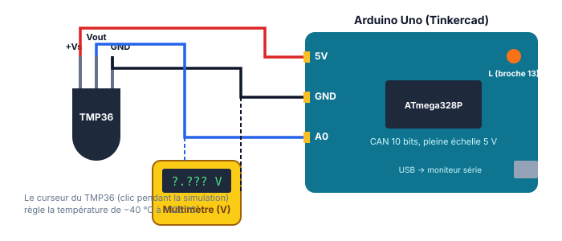

::: prof
**Mise en œuvre** : TSTI2D2, vendredi après-midi. Environ 1 h 45 de TP et 15 min de correction ou de remédiation. Les points de validation ✋ se notent sur la grille pendant la séance. Préparer une grille par binôme.
**Valeurs mesurées** : le simulateur peut donner un code $N$ à ±1 près des valeurs du corrigé ; accepter si le raisonnement est juste.
:::

## 1. Contextualisation & Système Étudié

::: contexte La salle serveur du lycée
Les serveurs du lycée (ENT, réseau pédagogique) sont regroupés dans une petite salle climatisée. Si la climatisation tombe en panne, la température monte vite et les serveurs risquent de s'arrêter. Le service informatique veut une **alerte dès que la température dépasse 27 °C**, et un **affichage de la température à 0,5 °C près**.

On prototype la solution dans **Tinkercad Circuits** avec une carte Arduino Uno et un capteur de température analogique TMP36.
:::

::: problematique
La chaîne capteur TMP36 + CAN de l'Arduino permet-elle de mesurer la température à 0,5 °C près ? Comment déclencher l'alerte ?
:::

::: figure Montage à réaliser dans Tinkercad

:::

:::: doc DR1 | Capteur de température TMP36 (extrait simplifié)
| Caractéristique | Valeur |
| :--- | :--- |
| Alimentation | 2,7 V à 5,5 V |
| Étendue de mesure | −40 °C à +125 °C |
| Tension de sortie | $V_{out} = 0{,}5\text{ V} + 0{,}01\text{ V/°C} \times T$ (soit 750 mV à 25 °C) |
| Précision typique | ±2 °C |
::::

:::: doc DR2 | CAN de la carte Arduino Uno
| Caractéristique | Valeur |
| :--- | :--- |
| Nombre de bits | 10 |
| Pleine échelle (référence par défaut) | 5 V |
| Fonction de lecture | `analogRead(A0)` renvoie le code $N$, de 0 à 1 023 |
::::

## 2. Travail Demandé

### Partie A — Prévoir (≈ 25 min)

::: question 1 [2 pt]
À l'aide du DR1, calculer la tension de sortie du TMP36 pour 20 °C, 27 °C, −40 °C et 125 °C.
:::

::: reponse 4
$V_{out} = 0{,}5 + 0{,}01 \times T$ : 20 °C → 0,70 V ; 27 °C → 0,77 V ; −40 °C → 0,10 V ; 125 °C → 1,75 V. (0,5 pt chacun)
:::

::: question 2 [2 pt]
Calculer le quantum $q$ du CAN de l'Arduino (DR2), puis la plus petite variation de température que la chaîne peut détecter. Le cahier des charges (affichage à 0,5 °C près) est-il respecté ?
:::

::: reponse 4
$q = \dfrac{5}{1\,024} \approx 4{,}88\text{ mV}$. (1 pt) Résolution en température : $\dfrac{q}{0{,}01\text{ V/°C}} \approx 0{,}49\text{ °C}$. Elle est inférieure à 0,5 °C, donc **c'est respecté, de justesse**. (1 pt)
:::

::: question 3 [1 pt]
Quel code $N$ le CAN doit-il fournir au seuil d'alerte de 27 °C ?
:::

::: reponse 2
$N = \dfrac{0{,}77}{0{,}004\,88} \approx 157{,}7$ → $N = 157$.
:::

### Partie B — Réaliser et mesurer (≈ 1 h)

::: question 4 [2 pt]
Réaliser le montage dans Tinkercad : TMP36 alimenté en 5 V, sortie $V_{out}$ sur l'entrée **A0**, multimètre en voltmètre entre $V_{out}$ et GND. Lancer la simulation, régler le capteur sur **25 °C** et relever la tension affichée par le multimètre. Comparer à la valeur attendue.

✋ **Validation professeur** : montage et mesure.
:::

::: reponse 3
Multimètre : **0,750 V**, conforme au DR1 ($0{,}5 + 0{,}01 \times 25$). (1 pt montage, 1 pt mesure et comparaison)
:::

::: question 5 [4 pt]
Copier le programme de départ dans l'éditeur de code (mode « Texte »), puis compléter les zones `TODO Q5` pour calculer la tension `v` puis la température `t` à partir du code `n`. Afficher le résultat dans le moniteur série.

```cpp
// station_temperature.ino - PROGRAMME DE DEPART
const int PIN_CAPTEUR = A0;
const int PIN_ALARME = 13;          // LED "L" integree a la carte
const float PLEINE_ECHELLE = 5.0;   // pleine echelle du CAN (V)
const int NB_CODES = 1024;          // CAN 10 bits
const float SEUIL = 27.0;           // seuil d'alerte (degC)

void setup() {
  Serial.begin(9600);
  pinMode(PIN_ALARME, OUTPUT);
}

void loop() {
  int n = analogRead(PIN_CAPTEUR);  // code numerique de 0 a 1023

  // TODO Q5 : calculer la tension v (en V) a partir de n
  float v = 0;

  // TODO Q5 : calculer la temperature t (en degC) a partir de v
  float t = 0;

  Serial.print("N = ");
  Serial.print(n);
  Serial.print("   V = ");
  Serial.print(v, 3);
  Serial.print(" V   T = ");
  Serial.print(t, 1);
  Serial.println(" degC");

  // TODO Q7 : allumer la LED d'alarme si t depasse SEUIL, l'eteindre sinon

  delay(1000);
}
```
:::

::: reponse 4
```cpp
  float v = n * PLEINE_ECHELLE / NB_CODES;   // tension en V
  float t = (v - 0.5) * 100.0;               // DR1 : T = (Vout - 0,5) / 0,01
```
2 pt pour chaque ligne. Pénaliser une division entière (`n / NB_CODES * 5`, qui donne 0) ; c'est l'occasion d'en expliquer la cause.
:::

::: question 6 [4 pt]
Régler successivement le capteur aux températures du tableau. Relever le code $N$ et la température calculée par le programme, puis calculer l'écart. Conclure : l'écart est-il cohérent avec la résolution calculée en Q2 ?

| Température réglée (°C) | −10 | 0 | 25 | 27 | 50 |
| :--- | :---: | :---: | :---: | :---: | :---: |
| Code $N$ lu | | | | | |
| Température calculée (°C) | | | | | |
| Écart (°C) | | | | | |

✋ **Validation professeur** : tableau rempli.
:::

::: reponse 5
| Température réglée (°C) | −10 | 0 | 25 | 27 | 50 |
| :--- | :---: | :---: | :---: | :---: | :---: |
| Code $N$ lu | 81 | 102 | 153 | 157 | 204 |
| Température calculée (°C) | −10,5 | −0,2 | 24,7 | 26,7 | 49,6 |
| Écart (°C) | −0,5 | −0,2 | −0,3 | −0,3 | −0,4 |

(2 pt mesures, 1 pt écarts) Les écarts sont tous **inférieurs à un quantum en température (0,49 °C)** : ils viennent de la quantification, la chaîne est cohérente. La mesure est toujours un peu inférieure, car le code est arrondi à l'entier inférieur. (1 pt conclusion)
:::

::: question 7 [2 pt]
Compléter la zone `TODO Q7` pour que la LED « L » s'allume au-dessus de 27 °C. Tester en faisant varier la température autour du seuil.

✋ **Validation professeur** : alerte fonctionnelle.
:::

::: reponse 3
```cpp
  if (t > SEUIL) {
    digitalWrite(PIN_ALARME, HIGH);
  } else {
    digitalWrite(PIN_ALARME, LOW);
  }
```
(1 pt code, 1 pt test) Prolongement possible : seuil avec hystérésis pour éviter que la LED clignote autour de 27 °C.
:::

### Partie C — Améliorer (≈ 20 min)

::: question 8 [3 pt]
Le service informatique veut maintenant un affichage **à 0,1 °C près**.

**a)** En gardant une pleine échelle de 5 V, combien de bits faudrait-il au CAN au minimum ?

**b)** Proposer une autre solution qui ne change pas le nombre de bits.
:::

::: reponse 4
**a)** Il faut $q \le 0{,}1 \times 0{,}01 = 1\text{ mV}$, donc $\dfrac{5}{2^n} \le 0{,}001$, d'où $2^n \ge 5\,000$ et $n = 13$ bits ($2^{13} = 8\,192$). (2 pt)

**b)** **Réduire la pleine échelle** pour l'adapter à la plage utile. Entre 0 et 50 °C, $V_{out}$ reste sous 1 V : avec une référence de 1,1 V, $q = 1{,}1 / 1\,024 \approx 1{,}07\text{ mV}$, soit environ 0,1 °C. Autre réponse acceptée : **amplifier** le signal du capteur (conditionnement). (1 pt)
:::

## 3. Bilan & Synthèse des Acquis

::: retenir
- Le CAN de l'Arduino est un CAN [[10]] bits de pleine échelle 5 V : son quantum vaut environ [[4,88 mV]].
- La résolution de la chaîne en température vaut $\dfrac{q}{s}$ : environ [[0,49 °C]] avec le TMP36.
- Pour améliorer la résolution : plus de [[bits]], une pleine échelle plus [[petite]], ou une amplification du signal.
:::

## 4. Barème & Grille d'Évaluation

| Compétence | Questions | Critères | Points |
| :--- | :--- | :--- | :---: |
| **CO7.3-SIN1** — Expérimenter une chaîne d'acquisition | Q1 à Q4, Q6 | Calculs justes et justifiés, montage fonctionnel, mesures relevées, écarts expliqués par la quantification | 11 |
| **CO5.8-SIN2** — Programmer la réponse logicielle | Q5, Q7 | Conversion code → tension → température juste (pas de division entière), alerte fonctionnelle | 6 |
| **CO7.2** — Valider et proposer une amélioration | Q8 | Nombre de bits justifié, solution alternative pertinente | 3 |
| **Total** | | | **20** |
